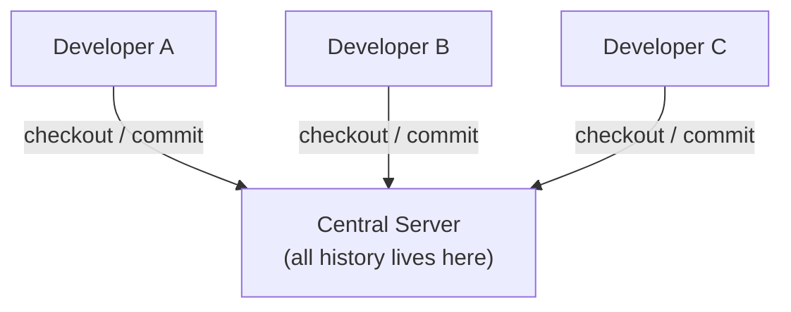
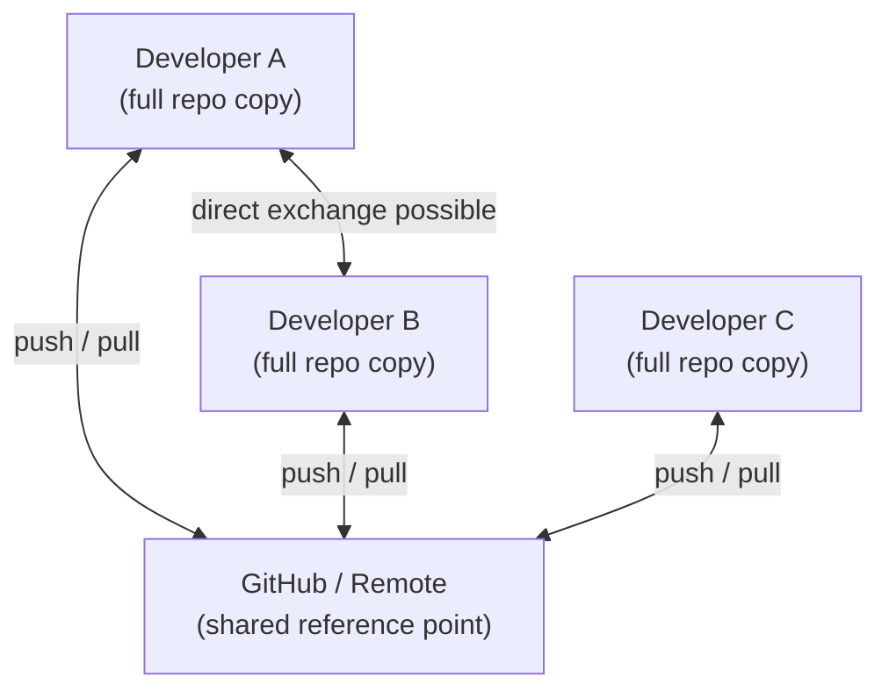

# Version Control Fundamentals

Before Git makes sense, version control itself needs to make sense. This guide walks you through what it is, why it exists, and how Git fits into the bigger picture.

---

## What Is Version Control?

Version control is a system that records changes to files over time so you can recall specific versions later.

Without version control, you end up doing things like this:

```
project-final.zip
project-final-v2.zip
project-final-ACTUALLY-FINAL.zip
project-final-USE-THIS-ONE.zip
```

With version control, you get a clean timeline of every change, who made it, and why.

---

## Why Version Control Matters

Here's what version control gives you that manual file management can't:

| Problem | Without VCS | With VCS |
|---------|------------|----------|
| Made a mistake | Manually undo or lose work | `git revert` or `git reset` |
| Working in a team | Emailing zip files, conflicts everywhere | Everyone works in their own branch |
| Need to see what changed | Open two files and compare manually | `git diff`, `git log` |
| Need to go back in time | Nothing — it's gone | Checkout any previous commit |
| Audit trail | None | Full history with author, date, message |

---

## Centralized vs Distributed VCS

There are two fundamental models:

### Centralized (CVCS)

One server holds all the history. Everyone checks out files from that server and commits back to it.



**The problem:** if the server goes down, nobody can work. If the server's hard drive fails and there's no backup, everything is gone.

### Distributed (DVCS)

Every developer has a full copy of the repository — complete history included. There's still usually a "central" remote server (like GitHub), but it's a convention, not a requirement.



**The advantage:** you can commit, branch, and view history with zero internet connection. The remote is just where you sync.

---

## Other Version Control Systems

### CVS — Concurrent Versions System

Released in 1986. One of the earliest VCS tools.

- File-level locking (only one person edits a file at a time)
- No atomic commits (a commit could partially apply and leave the repo in a broken state)
- No rename tracking
- **Status:** effectively dead, not used for new projects

### SVN — Apache Subversion

Released in 2000. Built to fix CVS's problems.

- Atomic commits (all-or-nothing)
- Directory versioning and file renames
- Single central repository
- Still used in some legacy enterprise systems and in the kernel/Apache ecosystem
- **Status:** declining, but alive in legacy environments

```bash
# What SVN looked like
svn checkout https://svn.example.com/repos/myproject
svn update
svn commit -m "Fixed login bug"
```

### Mercurial (Hg)

Released in 2005, same year as Git. Distributed like Git but with a simpler, more consistent CLI.

- Used by Facebook, Mozilla, and Bitbucket (until 2020)
- Bitbucket dropped Mercurial support in 2020 in favour of Git
- **Status:** niche but maintained, rarely chosen for new projects

### Perforce (Helix Core)

Built for very large codebases with large binary files.

- Still widely used in game development (EA, Activision, Epic Games)
- Handles binary assets (3D models, textures, videos) better than Git
- Can scale to hundreds of gigabytes of history
- Expensive, requires dedicated server infrastructure
- **Status:** alive and dominant in specific industries (gaming, hardware)

---

## Why Git Won

Git was created by Linus Torvalds in 2005 to manage the Linux kernel source code after the team's previous VCS (BitKeeper) withdrew free access.

The design goals were:
1. Speed
2. Simple design
3. Strong support for non-linear development (thousands of parallel branches)
4. Fully distributed
5. Able to handle large projects efficiently

Here's how Git compares to the alternatives:

| Feature | CVS | SVN | Mercurial | Perforce | Git |
|---------|-----|-----|-----------|----------|-----|
| Distributed | ❌ | ❌ | ✅ | ❌ | ✅ |
| Offline work | ❌ | ❌ | ✅ | ❌ | ✅ |
| Branching cost | Expensive | Moderate | Cheap | Expensive | Very cheap |
| Binary files | Poor | Moderate | Poor | Excellent | Poor (use Git LFS) |
| Speed | Slow | Moderate | Fast | Fast | Very fast |
| Ecosystem | Dead | Limited | Limited | Enterprise | Massive |
| Free hosting | None | Limited | Bitbucket (gone) | No | GitHub / GitLab / Bitbucket |
| Learning curve | Moderate | Moderate | Easy | Steep | Moderate |

The ecosystem is the deciding factor today. GitHub alone hosts over 420 million repositories. Every CI/CD tool, every cloud platform, every IDE integrates with Git first.

---

## Git in One Paragraph

Git is a distributed version control system. When you run `git init`, Git creates a hidden `.git` folder in your project directory. That folder IS your repository — it contains the full history of every change ever made. When you `git commit`, Git takes a snapshot of your project and stores it permanently in that folder. When you `git push`, you copy those snapshots to a remote server like GitHub so others can access them.

---

## Knowledge Check

1. What's the difference between a centralized and a distributed VCS?
2. Why would a game studio choose Perforce over Git?
3. If GitHub went down right now, could you still commit code? Why?
4. What does an atomic commit mean, and why does SVN's implementation of it matter?
5. You're joining a team that uses SVN. What would you lose compared to Git?

---

Next: [Git Architecture & Internals →](02-git-architecture.md)
