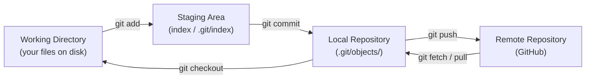
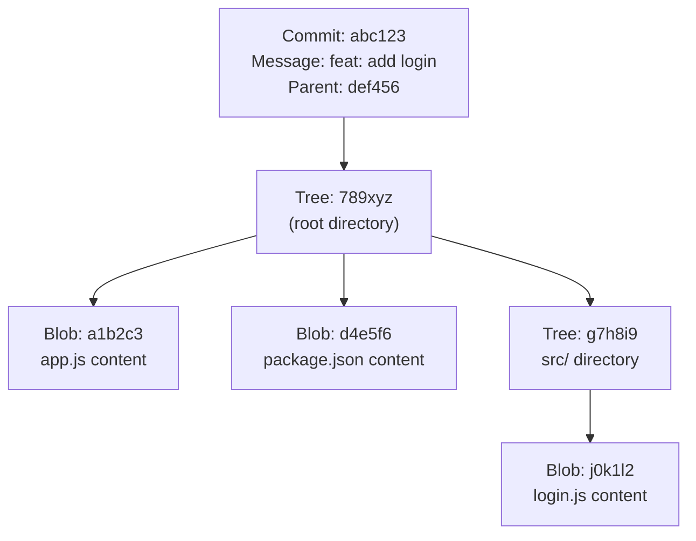

# Git Architecture & Internals

Understanding how Git stores and manages data changes how you work with it. Once you see what's happening under the hood, commands like `reset`, `rebase`, and `reflog` stop being scary.

---

## The Three Local Areas

Every Git project has three areas you interact with constantly:



### Working Directory

This is your actual project folder — the files you see in VS Code or File Explorer. Git watches this directory but doesn't manage it until you tell it to.

```bash
# See what's changed in your working directory
git status
git diff
```

### Staging Area (Index)

The staging area is a preparation zone. You explicitly choose which changes go into the next commit. This lets you commit some changes while leaving others out.

```bash
# Stage a specific file
git add src/login.js

# Stage everything
git add .

# Stage parts of a file (interactive)
git add -p src/login.js

# See what's staged
git diff --staged
```

### Local Repository

When you commit, Git writes a permanent snapshot into the `.git/objects/` directory. This is the actual repository — a database of every snapshot you've ever committed.

```bash
# Commit staged changes
git commit -m "feat: add user login"

# See the full commit history
git log --oneline
```

---

## The Remote Repository

The remote (GitHub, GitLab, Bitbucket) is just another Git repository. It's the shared reference point for your team.

```bash
# See your configured remotes
git remote -v

# Add a remote
git remote add origin https://github.com/you/your-repo.git

# Push your commits to the remote
git push origin main

# Bring remote commits down (doesn't merge)
git fetch origin

# Bring remote commits down AND merge
git pull origin main
```

---

## The Git Object Model

Git stores everything as **objects** in `.git/objects/`. There are four types:

### Blob

A blob stores the raw contents of a file — just the data, no filename.

```
$ git cat-file -t a1b2c3d4
blob

$ git cat-file -p a1b2c3d4
const express = require('express');
const app = express();
...
```

### Tree

A tree object maps filenames to blobs and other trees. It represents a directory.

```
$ git cat-file -p HEAD^{tree}
100644 blob a1b2c3d4    app.js
100644 blob e5f6a7b8    package.json
040000 tree c9d0e1f2    src/
```

### Commit

A commit object points to a tree (snapshot of your project) and stores metadata: author, timestamp, message, and the parent commit(s).

```
$ git cat-file -p HEAD
tree c9d0e1f2...
parent 7a8b9c0d...
author Sarowar Alam <sarowar@example.com> 1718900000 +0600
committer Sarowar Alam <sarowar@example.com> 1718900000 +0600

feat: add product listing page
```

### Tag

A tag object points to a specific commit and adds a label — useful for releases.

```bash
git tag v1.0.0
git tag -a v1.0.0 -m "First stable release"
```

---

## How Objects Relate

Every object is identified by a **SHA-1 hash** — a 40-character string like `a1b2c3d4e5f6...`. Git calculates this hash from the object's content, which means identical content always produces the same hash.



---

## Step-by-Step: What Happens During a Commit

```bash
git add src/login.js
```
1. Git reads `src/login.js` from your working directory
2. Creates a blob object from its contents
3. Writes that blob into `.git/objects/`
4. Updates `.git/index` (staging area) to reference the blob

```bash
git commit -m "feat: add login page"
```
1. Git reads the staging area
2. Creates a tree object representing the current state of all staged files
3. Creates a commit object pointing to that tree, with your message and the previous commit as parent
4. Moves the current branch pointer (`HEAD`) to point to the new commit

---

## HEAD — Where You Are

`HEAD` is a pointer to the current branch you're on (or directly to a commit in detached state).

```bash
# See where HEAD points
cat .git/HEAD
# → ref: refs/heads/main

# See the commit HEAD points to
git rev-parse HEAD
# → a1b2c3d4e5f6...

# A branch is just a file containing a commit hash
cat .git/refs/heads/main
# → a1b2c3d4e5f6...
```

This means a branch is just a 41-byte text file. Cheap to create, cheap to delete.

---

## The `.git` Directory

```
.git/
├── HEAD              # points to current branch
├── index             # staging area
├── config            # repo-level git config
├── objects/          # all blobs, trees, commits, tags
│   ├── ab/
│   │   └── c123...   # object files (first 2 chars = folder)
│   ├── pack/         # packfiles for efficiency
│   └── info/
├── refs/
│   ├── heads/        # local branches
│   ├── remotes/      # remote-tracking branches
│   └── tags/         # tags
└── logs/
    ├── HEAD          # reflog for HEAD
    └── refs/heads/   # reflog per branch
```

---

## Knowledge Check

1. You run `git add file.txt`. Where does Git write the blob object?
2. What's the difference between `git fetch` and `git pull`?
3. If two developers have identical file contents, will their blobs have the same SHA-1 hash?
4. A branch is just a file. What does that file contain?
5. You delete the `.git` folder. What happens to your working directory? What's lost?

---

Previous: [Version Control Fundamentals →](01-version-control-fundamentals.md)
Next: [Git Branching →](03-git-branching.md)
