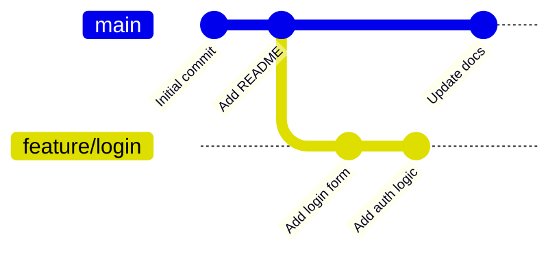

# Git Branching

A branch is one of Git's most powerful features — and one of its cheapest operations. Creating a branch takes milliseconds and costs almost nothing. This guide covers everything you need to work confidently with branches.

---

## What Is a Branch?

A branch is a lightweight pointer to a specific commit. When you create a branch, Git writes a single 41-byte file. That's it.



The `main` branch and `feature/login` branch both point to commits in the same history. They diverge only from the point where you branched.

---

## Creating a Branch

```bash
# See all local branches
git branch

# Create a branch (you stay on your current branch)
git branch feature/payment

# Create AND switch to it immediately
git checkout -b feature/payment

# Modern syntax (Git 2.23+)
git switch -c feature/payment

# Create a branch from a specific commit (not from HEAD)
git branch hotfix/login-crash abc123def
```

---

## Switching Between Branches

```bash
# Switch to main
git switch main
# or older syntax
git checkout main

# Switch to feature/payment
git switch feature/payment

# Toggle back to the previous branch you were on
git switch -
git checkout -     # same thing

# See which branch you're on
git branch         # asterisk (*) marks current
git status         # line 1 shows current branch
```

> Always commit or stash your work before switching. If you have uncommitted changes that conflict with the target branch, Git will block the switch and tell you.

---

## What Happens to Your Files When You Switch?

Git updates your working directory to match the state of the branch you're switching to.

```bash
# You're on feature/payment — you have a file payments.js
git switch main
# payments.js disappears from your working directory (it's safe in the feature branch)

git switch feature/payment
# payments.js is back
```

Nothing is lost. Git is just showing you the right snapshot for each branch.

---

## Creating a Backup Branch

Before doing anything risky (a big rebase, a complex merge, an experimental refactor), create a backup:

```bash
# You're on feature/search — about to do a complex rebase
git branch backup/feature-search-before-rebase

# That's it. You haven't moved anywhere.
# If things go wrong:
git reset --hard backup/feature-search-before-rebase

# Once you're confident the work is good, clean up
git branch -d backup/feature-search-before-rebase
```

---

## Renaming a Branch

```bash
# Rename the current branch
git branch -m new-name

# Rename a specific branch (from anywhere)
git branch -m old-name new-name

# After renaming, update the remote tracking
git push origin --delete old-name
git push origin -u new-name
```

---

## Deleting a Branch

```bash
# Delete a fully merged branch (safe — Git checks it's merged)
git branch -d feature/payment

# Force delete even if not merged (use with care)
git branch -D feature/abandoned-experiment

# Delete a remote branch
git push origin --delete feature/payment

# After someone else deleted a remote branch, clean up your local refs
git fetch --prune
# or set this permanently:
git config --global fetch.prune true
```

---

## Viewing Branches

```bash
# List local branches
git branch

# List remote branches
git branch -r

# List all branches (local + remote)
git branch -a

# Show last commit on each branch
git branch -v

# Show branches merged into current branch
git branch --merged

# Show branches NOT merged into current branch
git branch --no-merged
```

---

## Branch Naming Standards

Consistent branch names make repositories readable at scale. A common convention:

| Type | Pattern | Example |
|------|---------|---------|
| Feature | `feature/<description>` | `feature/user-authentication` |
| Bug fix | `fix/<description>` | `fix/login-redirect-loop` |
| Hotfix (urgent) | `hotfix/<description>` | `hotfix/payment-crash` |
| Release | `release/<version>` | `release/v2.1.0` |
| Chore / maintenance | `chore/<description>` | `chore/upgrade-node-18` |
| Experiment | `experiment/<description>` | `experiment/ai-search` |
| Backup | `backup/<description>` | `backup/main-before-migration` |

**Rules that keep things clean:**
- Use lowercase and hyphens — no spaces, no uppercase, no underscores
- Include a ticket/issue number when you have one: `feature/JIRA-123-user-login`
- Keep names short but descriptive — `feature/x` is useless, `feature/user-profile-avatar-upload` is too long
- Never name a branch the same as a tag

---

## Tracking Remote Branches

When you push a branch, you usually want Git to track the remote version so `git push` and `git pull` work without arguments:

```bash
# Push and set tracking in one step
git push -u origin feature/payment
# -u is short for --set-upstream

# After this, you can just run:
git push
git pull

# Check tracking relationships
git branch -vv
```

---

## Knowledge Check

1. You run `git branch feature/x` — which branch are you on now?
2. What's the difference between `git branch -d` and `git branch -D`?
3. You switch branches and a file disappears. Has Git deleted it? Where is it?
4. How do you quickly switch back to the branch you were on before?
5. Your team uses the pattern `feature/<name>`. You name a branch `Feature/LoginPage`. What two naming rules did you break?

---

Previous: [Git Architecture →](02-git-architecture.md)
Next: [Branching Strategies →](04-branching-strategies.md)
