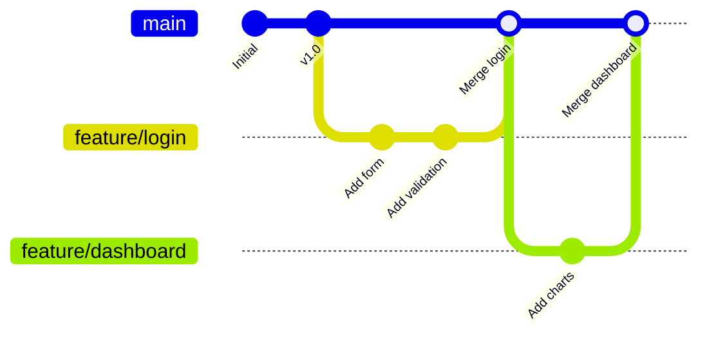
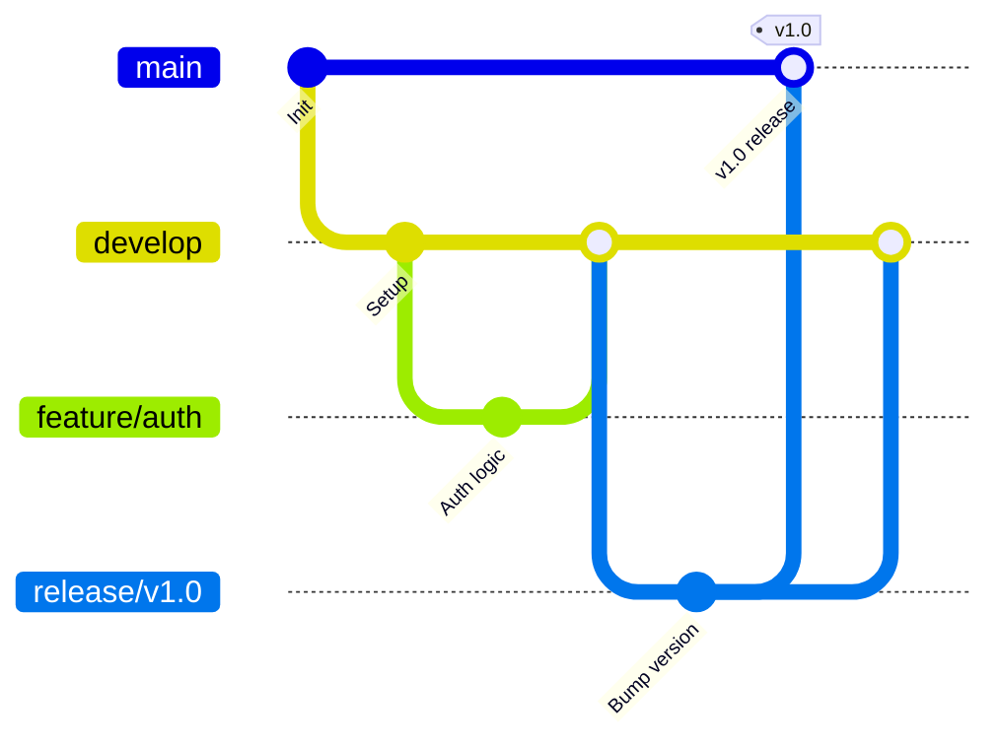
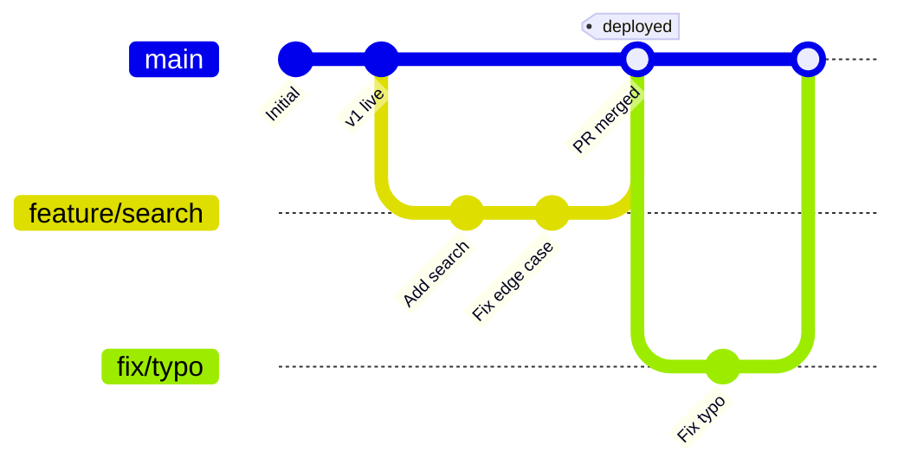

# Branching Strategies

A branching strategy is an agreement within your team about how branches are created, named, merged, and deleted. Without one, repositories turn into spaghetti. With the right one, deployments become predictable and collaboration becomes smooth.

---

## Feature Branch Workflow

The simplest strategy that works for most teams.

**The idea:** `main` always works. Every piece of work — features, fixes, experiments — happens in its own branch. You merge back to `main` only when it's done and reviewed.



**Works best for:** small to medium teams, simple release cadence.

---

## Git Flow

Created by Vincent Driessen in 2010. Designed for projects with scheduled releases (e.g., v1.0, v2.0 every quarter).

**Branch types:**

| Branch | Purpose | Merges into |
|--------|---------|-------------|
| `main` | Production-ready code | — |
| `develop` | Integration branch, next release | `main` |
| `feature/*` | New features | `develop` |
| `release/*` | Release stabilisation | `main` + `develop` |
| `hotfix/*` | Urgent production fixes | `main` + `develop` |



**Works best for:** teams with versioned releases, open-source projects, apps with multiple versions in the wild.

**Drawbacks:** heavy process, lots of branches, can slow down small teams.

---

## GitHub Flow

A simplified approach built around continuous deployment. One long-lived branch (`main`), everything else is a short-lived feature branch with a pull request.

```
1. Create a branch from main
2. Make your changes, commit regularly
3. Open a pull request
4. Get it reviewed
5. Deploy from the branch (or merge and deploy from main)
6. Delete the branch
```



**Works best for:** teams that deploy frequently (daily or more), SaaS products, web applications.

**Drawbacks:** requires strong CI/CD and feature flags for incomplete work.

---

## GitLab Flow

A middle ground between Git Flow and GitHub Flow. Adds environment branches.

```
main → staging → production
```

Features branch off `main`. When `main` is stable, it merges into `staging`. When `staging` passes QA, it merges to `production`.

**Works best for:** teams with multiple environments (dev → staging → prod) and specific release gates.

---

## Trunk-Based Development (TBD)

Everyone commits directly to `main` (the "trunk") — or uses very short-lived branches (less than 2 days). Incomplete features are hidden behind feature flags.

```
main: A → B → C → D → E → F  (all developers committing here)
                              (feature flags hide incomplete work)
```

**Works best for:** high-velocity teams with strong CI/CD, senior engineers comfortable with feature flags.

**Drawbacks:** requires discipline, feature flags add complexity, not suitable for beginners.

---

## Comparison Table

| Strategy | Branches | Release cadence | CI/CD required | Best for |
|----------|---------|----------------|---------------|---------|
| Feature Branch | `main` + feature | Flexible | Recommended | Most teams |
| Git Flow | `main` + `develop` + many | Scheduled | Optional | Versioned releases |
| GitHub Flow | `main` + feature | Continuous | Required | SaaS / web apps |
| GitLab Flow | `main` + env branches | Environment-gated | Required | Multi-environment teams |
| Trunk-Based | `main` only | Continuous | Required | High-velocity teams |

---

## Which One Should You Use?

Start with **GitHub Flow** unless you have a specific reason not to. It's simple, forces pull request reviews, and works with GitHub's free tier perfectly. Move to Git Flow only when you genuinely need scheduled releases with multiple versions in the wild.

**Decision checklist:**
- Deploying multiple times a day? → GitHub Flow or TBD
- Quarterly scheduled releases? → Git Flow
- Multiple live environments (staging, prod)? → GitLab Flow
- Small team, just getting started? → Feature Branch Workflow

---

## Knowledge Check

1. In Git Flow, where do feature branches merge to?
2. What's the key difference between GitHub Flow and Git Flow?
3. Your team deploys to production three times a day. Which strategy fits?
4. What is a "trunk" in Trunk-Based Development?
5. You need to support v1.x and v2.x simultaneously in production. Which strategy handles this best?

---

Previous: [Git Branching →](03-git-branching.md)
Next: [Merging & Rebasing →](05-merging-and-rebasing.md)
