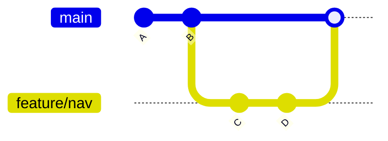
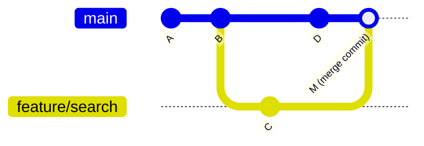

# Merging & Rebasing

Getting changes from one branch into another is something you'll do dozens of times a week. Understanding the difference between merging and rebasing — and when to use each — is one of the most important skills in day-to-day Git work.

---

## Fast-Forward Merge

The simplest merge. When the target branch has no new commits since you branched off, Git just moves the pointer forward.



Before merge: `main` points to B, `feature/nav` points to D.
After fast-forward: `main` now points to D — no merge commit created.

```bash
git checkout main
git merge feature/nav          # fast-forward by default
git merge --ff-only feature/nav  # fail if FF isn't possible
```

---

## Three-Way Merge

When both branches have diverged (each has commits the other doesn't), Git uses a three-way merge. It finds the common ancestor, compares both branches against it, and creates a **merge commit** with two parents.



```bash
git checkout main
git merge feature/search    # creates a merge commit
git merge --no-ff feature/search  # force a merge commit even if FF is possible
```

Use `--no-ff` when you want the branch boundary preserved in the history — makes it easy to see what was part of a feature.

---

## Merge Conflicts

A conflict happens when both branches changed the same part of the same file. Git can't decide which version to keep, so it pauses and asks you.

```bash
$ git merge feature/search
Auto-merging src/app.js
CONFLICT (content): Merge conflict in src/app.js
Automatic merge failed; fix conflicts and then commit the result.
```

Git marks the conflicting file like this:

```
<<<<<<< HEAD
const results = searchByTitle(query);
=======
const results = searchByCategory(query);
>>>>>>> feature/search
```

- Everything between `<<<<<<< HEAD` and `=======` is **your current branch's version**
- Everything between `=======` and `>>>>>>> feature/search` is **the incoming branch's version**

### Resolving a Conflict

```bash
# Step 1 — see all conflicting files
git status

# Step 2 — open each conflicted file and edit it
# Remove the markers, keep what's correct:
const results = searchByTitle(query) || searchByCategory(query);

# Step 3 — mark it resolved by staging it
git add src/app.js

# Step 4 — complete the merge
git commit
# Git pre-fills the merge commit message, just save it

# Or — if you want to abort and go back to before the merge
git merge --abort
```

> 📸 Screenshot: VS Code shows conflicting blocks with Accept Current / Accept Incoming / Accept Both buttons in the gutter. Use those buttons instead of editing markers manually.

---

## Rebase

Rebase moves your commits on top of another branch. Instead of a merge commit, it replays your work as if you had started from the latest point.

### Why Rebase?

Compare the history after a merge vs after a rebase when syncing a feature branch with `main`:

**Merge:**
```
main:    A ── B ── C ── D ──────────── M
                    \               /
feature:             E ── F ── G ──
```
History has a fork and a merge commit.

**Rebase:**
```
main:    A ── B ── C ── D
feature:                 E' ── F' ── G'
```
History is linear. Commits E, F, G are replayed as E', F', G' on top of D.

### How to Rebase

```bash
# You're on feature/search, and main has moved ahead
git checkout feature/search
git rebase main

# If there are conflicts during rebase:
# Fix the conflict in the file...
git add <conflicted-file>
git rebase --continue

# Skip a commit (rare — use with caution)
git rebase --skip

# Abort and go back to before
git rebase --abort
```

---

## Interactive Rebase

Interactive rebase lets you edit, squash, reorder, and drop commits before merging. It's how you clean up messy "WIP" commit history.

```bash
# Edit the last 4 commits
git rebase -i HEAD~4
```

Git opens an editor with:

```
pick a1b2c3 Add search form
pick d4e5f6 WIP search logic
pick g7h8i9 Fix typo in search
pick j0k1l2 Fix actual bug in search

# Commands:
# pick   = use commit as-is
# reword = use commit but edit the message
# edit   = use commit but pause to amend it
# squash = merge into previous commit (keeps both messages)
# fixup  = merge into previous commit (discards this message)
# drop   = remove the commit entirely
```

Common workflow — squash the WIP and fix commits into one clean commit:

```
pick a1b2c3 Add search form
squash d4e5f6 WIP search logic
fixup g7h8i9 Fix typo in search
fixup j0k1l2 Fix actual bug in search
```

Result: one clean commit with message "Add search form".

---

## Merge vs Rebase — When to Use Each

| Scenario | Use |
|----------|-----|
| Syncing a feature branch with main | Rebase |
| Merging a completed feature into main | Merge (with `--no-ff`) |
| Cleaning up commit history before a PR | Interactive rebase |
| Public/shared branches | **Never rebase** (rewrites history others depend on) |
| Preserving full branch history in main | Merge |
| Linear, readable history | Rebase |

> **The golden rule of rebase:** never rebase commits that have been pushed to a shared branch. Rebasing rewrites commit hashes — anyone else who has those commits will have a diverged history and a very bad day.

---

## Knowledge Check

1. When does Git do a fast-forward merge?
2. What does `--no-ff` do and why would you use it?
3. You're in the middle of a merge with conflicts. You want to cancel. What command do you run?
4. What does rebase do to commit hashes?
5. Your feature branch is 3 commits ahead of main, but main has moved 5 commits since you branched. You want a clean linear history. What do you do?

---

Previous: [Branching Strategies →](04-branching-strategies.md)
Next: [Repository Collaboration →](06-repository-collaboration.md)
