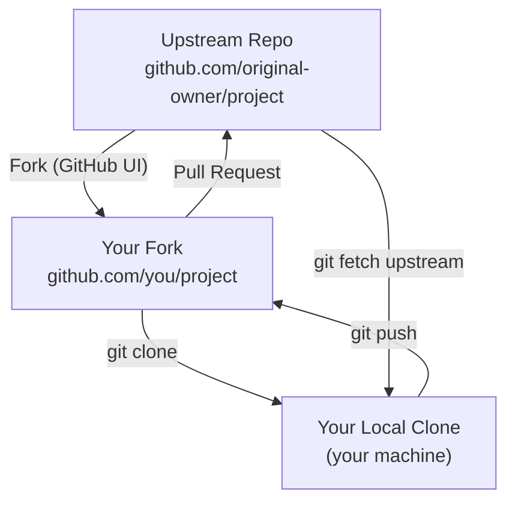
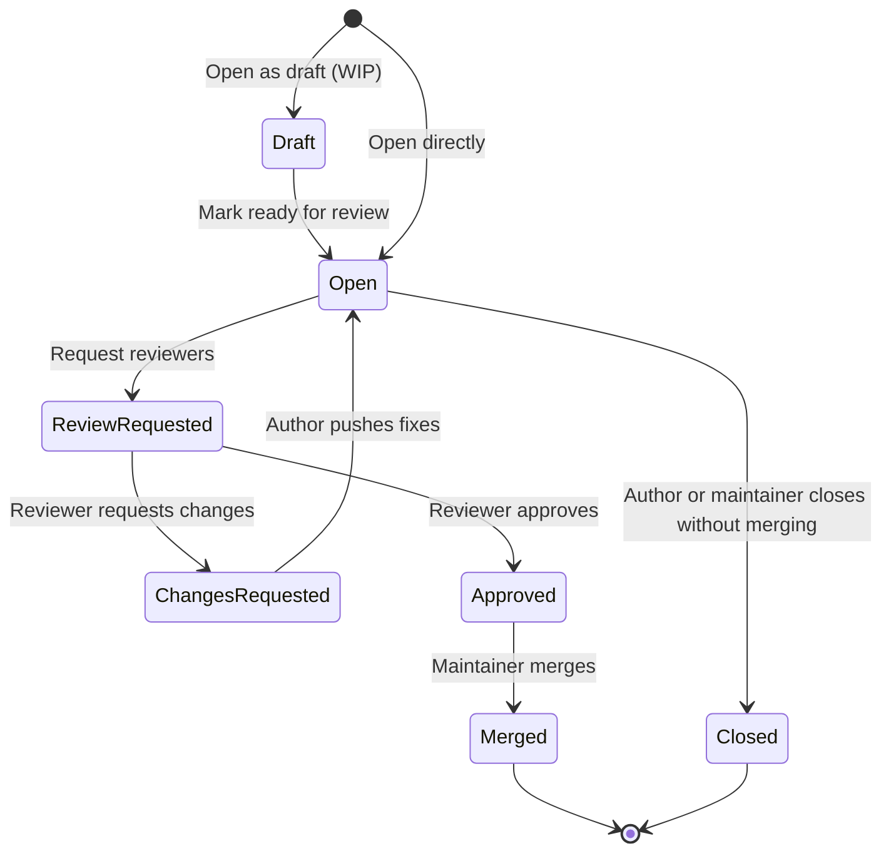

# Repository Collaboration

When you're working with other people's repositories — or contributing to projects you don't own — forking, upstream syncing, and pull requests are the core workflow. This guide walks through every step.

---

## Forking

A fork is your personal copy of someone else's repository on GitHub. It lives under your account and you have full write access to it. The original repository is called the **upstream**.

**When you fork:**
- You get a complete copy of the repo (all branches, all history)
- Your fork is independent — changes you make don't affect the original
- You can propose changes back to the original via a pull request



### How to Fork

1. Go to the repository on GitHub
2. Click the **Fork** button (top-right)
3. Choose your account as the destination
4. GitHub creates `github.com/you/project`

> 📸 Screenshot: GitHub repository page with Fork button highlighted in the top-right corner

---

## Cloning Your Fork

After forking, clone your fork (not the original) to work locally:

```bash
# Clone your fork
git clone https://github.com/you/project.git
cd project

# Verify your remote — it points to your fork
git remote -v
# origin  https://github.com/you/project.git (fetch)
# origin  https://github.com/you/project.git (push)
```

---

## Setting Up the Upstream Remote

Your fork is connected to your GitHub account (`origin`). To stay in sync with the original repository, you need to add it as a second remote called `upstream`:

```bash
# Add the original repo as upstream
git remote add upstream https://github.com/original-owner/project.git

# Verify both remotes are now configured
git remote -v
# origin    https://github.com/you/project.git (fetch)
# origin    https://github.com/you/project.git (push)
# upstream  https://github.com/original-owner/project.git (fetch)
# upstream  https://github.com/original-owner/project.git (push)
```

---

## Syncing Your Fork with Upstream

The upstream repo moves ahead while you work. Regularly syncing keeps your fork current and reduces merge conflicts.

```bash
# Step 1 — fetch the latest from upstream (doesn't change your files yet)
git fetch upstream

# Step 2 — switch to your main branch
git switch main

# Step 3 — merge upstream changes into your local main
git merge upstream/main

# Step 4 — push the updated main to your fork on GitHub
git push origin main
```

Or in one line after the fetch:
```bash
git fetch upstream && git merge upstream/main
```

### Keeping a Feature Branch Up to Date with Upstream

```bash
# Fetch latest upstream
git fetch upstream

# Rebase your feature branch on top of the latest upstream main
git switch feature/my-feature
git rebase upstream/main

# Force-push the rebased branch to your fork (safe — it's your fork)
git push origin feature/my-feature --force-with-lease
```

---

## Pull Requests

A pull request (PR) is a proposal to merge your branch into another repository's branch. On GitHub, it's also the place where code review happens.

### Opening a Pull Request

```bash
# 1. Make your changes on a feature branch
git switch -c feature/add-dark-mode
# ... make changes ...
git add .
git commit -m "feat: add dark mode toggle"

# 2. Push the branch to your fork
git push origin feature/add-dark-mode
```

3. Go to your fork on GitHub — GitHub shows a banner: **"Compare & pull request"**
4. Click it, fill in:
   - **Title:** clear, describes the change (e.g., `feat: add dark mode toggle`)
   - **Description:** what changed, why, how to test it, any screenshots
   - **Base repository/branch:** the upstream repo's `main` (or `develop`)
   - **Compare branch:** `feature/add-dark-mode`
5. Click **Create pull request**

> 📸 Screenshot: GitHub pull request form with title, description, base and compare dropdowns

---

## The Pull Request Lifecycle



---

## Code Review

When you're reviewing someone's PR on GitHub:

- **Comment** on specific lines by clicking the `+` icon in the diff view
- **Suggest changes** using the suggestion block — the author can apply your exact suggestion with one click
- **Approve** when the code is good to merge
- **Request changes** when you want something addressed before merging

```bash
# If you want to test the PR locally before approving
git fetch origin pull/42/head:pr-42
git switch pr-42
# Test the code...
git switch main
git branch -d pr-42
```

---

## Keeping Your PR Up to Date

If `main` moves while your PR is open (someone else's PR merged), GitHub will warn you that your branch is out of date.

```bash
# Bring main's latest changes into your PR branch
git fetch upstream
git switch feature/add-dark-mode
git rebase upstream/main

# Push the updated branch
git push origin feature/add-dark-mode --force-with-lease
```

> `--force-with-lease` is safer than `--force` — it refuses to push if someone else has pushed to the branch since your last fetch, preventing accidental overwrites.

---

## After Your PR Merges

```bash
# Clean up your local feature branch
git switch main
git pull upstream main
git branch -d feature/add-dark-mode

# Clean up the remote branch on your fork
git push origin --delete feature/add-dark-mode
```

---

## Knowledge Check

1. What's the difference between `origin` and `upstream` in a fork workflow?
2. You forked a repo a month ago and upstream has 40 new commits. Walk through the commands to sync your fork.
3. What does `--force-with-lease` protect against compared to plain `--force`?
4. You open a PR and the reviewer requests two changes. What do you do?
5. After your PR is merged, your local feature branch still exists. What's the cleanup?

---

Previous: [Merging & Rebasing →](05-merging-and-rebasing.md)
Next: [Repository Roles & Permissions →](07-repository-roles-permissions.md)
