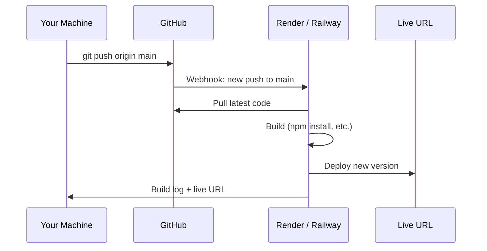

# Deploying with Git

Your code lives in Git. Your deployment platforms connect to Git. Understanding the link between a `git push` and a live deployment is one of the most practical skills in modern DevOps.

---

## How Git-Based Deployment Works

The basic model: you push code to a branch on GitHub, and a deployment platform detects that push and automatically builds and deploys your app.



---

## Render

[Render](https://render.com) has a generous free tier for static sites and web services. It connects directly to your GitHub repo and redeploys automatically on every push.

### Deploy a Static Site (company-website)

**What you need:**
- GitHub account
- Render free account (no credit card required)
- The `company-website` folder from this repo pushed to its own GitHub repo

**Step 1 — Create a repo for the site**

```bash
cd sample-repositories/company-website
git init
git add .
git commit -m "feat: initial company website"
gh repo create company-website --public --push --source=.
# or create manually on GitHub and push
```

**Step 2 — Connect to Render**

1. Log in at [dashboard.render.com](https://dashboard.render.com)
2. Click **New** → **Static Site**
3. Connect your GitHub account if you haven't
4. Select the `company-website` repository
5. Set:
   - **Name:** `company-website` (becomes part of your URL)
   - **Branch:** `main`
   - **Publish directory:** `.` (the root, since `index.html` is at the root)
6. Click **Create Static Site**

> 📸 Screenshot: Render "Create Static Site" form with repository selector, branch field, and publish directory field

Render builds and deploys. In about 30 seconds, your site is live at `https://company-website-xxxx.onrender.com`.

**Step 3 — Trigger a redeployment**

```bash
# Make a change
echo "<!-- updated -->" >> index.html
git add .
git commit -m "chore: trigger redeploy"
git push origin main
```

Watch the Render dashboard — it automatically picks up the push and redeploys.

### Deploy a Node.js App (ecommerce-app)

**Additional requirement:** Node.js v18+ installed locally

**Step 1 — Prepare the app**

The `ecommerce-app` already has a `package.json` with a `start` script. Make sure it's in its own repo:

```bash
cd sample-repositories/ecommerce-app
git init
git add .
git commit -m "feat: initial ecommerce app"
gh repo create ecommerce-app --public --push --source=.
```

**Step 2 — Connect to Render as a Web Service**

1. Render dashboard → **New** → **Web Service**
2. Select `ecommerce-app` repository
3. Set:
   - **Environment:** `Node`
   - **Branch:** `main`
   - **Build Command:** `npm install`
   - **Start Command:** `node app.js`
4. Under **Environment Variables**, add:
   - `PORT` = `3000`
   - `NODE_ENV` = `production`
5. Click **Create Web Service**

> 📸 Screenshot: Render Web Service settings with Build Command and Start Command fields

**Note:** Free tier web services spin down after 15 minutes of inactivity. The first request after spin-down takes ~30 seconds to respond (cold start).

### Environment Variables on Render

Never commit secrets. Instead, set them in Render's dashboard:

```
Dashboard → Your Service → Environment → Add Environment Variable
```

Access them in your Node.js code:

```javascript
const port = process.env.PORT || 3000;
const dbUrl = process.env.DATABASE_URL;
```

---

## Rollback on Render

If a new deployment breaks your app, roll back instantly:

```
Dashboard → Your Service → Events → click any previous deploy → Rollback to this deploy
```

Or rollback via Git — revert the bad commit and push:

```bash
git revert HEAD
git push origin main
# Render detects the push and redeploys the reverted code
```

---

## Heroku (Reference)

Heroku was the original platform that popularised git-push deployment. Since November 2022, it no longer has a free tier — the cheapest plan is $5/month (Eco dynos).

> **Free alternative:** Use Railway (https://railway.app) — $5 free credit monthly, no credit card required, very similar workflow to Heroku.

**How Heroku deployment works (for reference):**

```bash
# Install Heroku CLI
# https://devcenter.heroku.com/articles/heroku-cli

# Login
heroku login

# Create an app
heroku create my-app-name

# Heroku adds a remote called heroku
git remote -v
# heroku  https://git.heroku.com/my-app-name.git (fetch)
# heroku  https://git.heroku.com/my-app-name.git (push)

# Deploy by pushing to the heroku remote
git push heroku main

# Set environment variables
heroku config:set NODE_ENV=production
heroku config:set DATABASE_URL=postgres://...

# View logs
heroku logs --tail

# Open the live app
heroku open

# Rollback to previous release
heroku releases
heroku rollback v12
```

The key Heroku concept: `git push heroku main` sends your code to Heroku's Git server, which triggers a build using a **buildpack** (auto-detected for Node.js, Python, Ruby, etc.) and deploys the result.

---

## Railway (Free Heroku Alternative)

Railway is the closest free alternative to Heroku for server-side apps.

```bash
# Install Railway CLI
npm install -g @railway/cli

# Login
railway login

# Initialize a new project
railway init

# Deploy
railway up

# Open the deployed app
railway open
```

Railway also supports GitHub-connected deployments just like Render — connect your repo and it auto-deploys on push.

---

## Choosing the Right Platform

| Platform | Free tier | Static sites | Node.js apps | Docker | Auto-deploy from Git |
|----------|-----------|-------------|-------------|--------|---------------------|
| Render | ✅ (static free forever, services free with limits) | ✅ | ✅ | ✅ | ✅ |
| Railway | ✅ ($5 credit/month) | ✅ | ✅ | ✅ | ✅ |
| Vercel | ✅ | ✅ (excellent) | ✅ (serverless) | ❌ | ✅ |
| Netlify | ✅ | ✅ (excellent) | ❌ (functions only) | ❌ | ✅ |
| Heroku | ❌ ($5/month min) | ❌ | ✅ | ✅ | ✅ |

**Recommendation:**
- Static HTML/CSS/JS site → **Render** or **Netlify**
- Node.js / Express app → **Render** or **Railway**
- Already on Heroku → consider migrating to **Railway** (near-identical workflow)

---

## Knowledge Check

1. What triggers an automatic redeployment on Render?
2. Where do you set environment variables for a Render app — and why not in a file?
3. You deployed a broken version. What are two ways to roll back?
4. Why does Heroku no longer appear in the lab exercises?
5. You're deploying a Node.js app. Render asks for a "Build Command" and "Start Command". What should each one be?

---

Previous: [Git Best Practices →](12-git-best-practices.md)
Next: [Glossary →](glossary.md)
