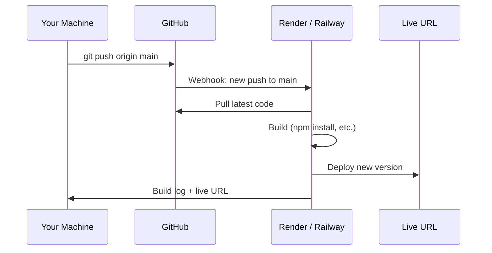

# Deploying with Git

Your code lives in Git. Your deployment platforms connect to Git. Understanding the link between a `git push` and a live deployment is one of the most practical skills in modern DevOps.

---

## How Git-Based Deployment Works

The basic model: you push code to a branch on GitHub, and a deployment platform detects that push and automatically builds and deploys your app.



---

## Render

[Render](https://render.com) has a generous free tier for static sites and web services. It connects directly to your GitHub repo and redeploys automatically on every push.

### Deploy a Static Site (company-website)

**What you need:**
- GitHub account
- Render free account (no credit card required)
- The `company-website` folder from this repo pushed to its own GitHub repo

**Step 1 — Create a repo for the site**

```bash
cd sample-repositories/company-website
git init
git add .
git commit -m "feat: initial company website"
gh repo create company-website --public --push --source=.
# or create manually on GitHub and push
```

**Step 2 — Connect to Render**

1. Log in at [dashboard.render.com](https://dashboard.render.com)
2. Click **New** → **Static Site**
3. Connect your GitHub account if you haven't
4. Select the `company-website` repository
5. Set:
   - **Name:** `company-website` (becomes part of your URL)
   - **Branch:** `main`
   - **Publish directory:** `.` (the root, since `index.html` is at the root)
6. Click **Create Static Site**

> 📸 Screenshot: Render "Create Static Site" form with repository selector, branch field, and publish directory field

Render builds and deploys. In about 30 seconds, your site is live at `https://company-website-xxxx.onrender.com`.

**Step 3 — Trigger a redeployment**

```bash
# Make a change
echo "<!-- updated -->" >> index.html
git add .
git commit -m "chore: trigger redeploy"
git push origin main
```

Watch the Render dashboard — it automatically picks up the push and redeploys.

### Deploy a Node.js App (ecommerce-app)

**Additional requirement:** Node.js v18+ installed locally

**Step 1 — Prepare the app**

The `ecommerce-app` already has a `package.json` with a `start` script. Make sure it's in its own repo:

```bash
cd sample-repositories/ecommerce-app
git init
git add .
git commit -m "feat: initial ecommerce app"
gh repo create ecommerce-app --public --push --source=.
```

**Step 2 — Connect to Render as a Web Service**

1. Render dashboard → **New** → **Web Service**
2. Select `ecommerce-app` repository
3. Set:
   - **Environment:** `Node`
   - **Branch:** `main`
   - **Build Command:** `npm install`
   - **Start Command:** `node app.js`
4. Under **Environment Variables**, add:
   - `PORT` = `3000`
   - `NODE_ENV` = `production`
5. Click **Create Web Service**

> 📸 Screenshot: Render Web Service settings with Build Command and Start Command fields

**Note:** Free tier web services spin down after 15 minutes of inactivity. The first request after spin-down takes ~30 seconds to respond (cold start).

### Environment Variables on Render

Never commit secrets. Instead, set them in Render's dashboard:

```
Dashboard → Your Service → Environment → Add Environment Variable
```

Access them in your Node.js code:

```javascript
const port = process.env.PORT || 3000;
const dbUrl = process.env.DATABASE_URL;
```

---

## Rollback on Render

If a new deployment breaks your app, roll back instantly:

```
Dashboard → Your Service → Events → click any previous deploy → Rollback to this deploy
```

Or rollback via Git — revert the bad commit and push:

```bash
git revert HEAD
git push origin main
# Render detects the push and redeploys the reverted code
```

---

## Heroku

Heroku pioneered git-push deployment. It no longer has a free tier since November 2022 — the minimum is **$5/month** (Eco dynos). It is included here as a fully supported option alongside Render.

> Install the Heroku CLI: https://devcenter.heroku.com/articles/heroku-cli

### Deploy a Static Site (company-website)

Heroku doesn't serve raw static files by default. Use the official `heroku-buildpack-static` buildpack, which needs a `static.json` config file.

**Step 1 — Add `static.json` to the repo**

```bash
cd sample-repositories/company-website
cat > static.json << 'EOF'
{
  "root": ".",
  "clean_urls": true,
  "error_page": "404.html"
}
EOF
git add static.json
git commit -m "chore: add Heroku static site config"
git push origin main
```

**Step 2 — Create the Heroku app**

```bash
heroku login

heroku create company-website-demo
# Heroku adds a 'heroku' remote automatically

git remote -v
# heroku  https://git.heroku.com/company-website-demo.git (fetch)
# heroku  https://git.heroku.com/company-website-demo.git (push)
# origin  https://github.com/md-sarowar-alam/company-website.git (fetch)
```

**Step 3 — Set the buildpack**

```bash
heroku buildpacks:set https://github.com/heroku/heroku-buildpack-static
```

**Step 4 — Deploy**

```bash
git push heroku main
```

Heroku builds the app and gives you a live URL:
```
remote: -----> Launching...
remote:        https://company-website-demo.herokuapp.com/ deployed to Heroku
```

> 📸 Screenshot: Heroku dashboard showing the app URL and activity log

**Step 5 — Make a change and redeploy**

```bash
echo "<!-- updated -->" >> index.html
git add index.html
git commit -m "chore: trigger redeploy"
git push heroku main
```

### Deploy a Node.js App (ecommerce-app)

**Step 1 — Add a `Procfile`**

Heroku needs a `Procfile` to know how to start your app:

```bash
cd sample-repositories/ecommerce-app
echo "web: node app.js" > Procfile
git add Procfile
git commit -m "chore: add Heroku Procfile"
git push origin main
```

**Step 2 — Create the app and deploy**

```bash
heroku create ecommerce-app-demo

git remote -v
# heroku  https://git.heroku.com/ecommerce-app-demo.git (fetch)

git push heroku main
```

**Step 3 — Set environment variables**

```bash
heroku config:set NODE_ENV=production
heroku config:set PORT=3000
```

Access them in your code exactly as with Render:
```javascript
const port = process.env.PORT || 3000;
```

**Step 4 — Verify**

```bash
heroku open
heroku logs --tail
```

### Rollback on Heroku

```bash
# List all releases
heroku releases
# v1  Deploy abc123  2025-01-01
# v2  Deploy def456  2025-01-02  ← broken
# v3  Set NODE_ENV   2025-01-02

# Roll back to v1
heroku rollback v1

# Or roll back one step
heroku rollback
```

Heroku keeps a full deployment history. Rollback is instant — it re-activates a previous slug without a rebuild.

You can also rollback via Git and redeploy:

```bash
git revert HEAD
git push heroku main
```

### Cleanup (Heroku)

```bash
# Delete the app (stops billing immediately)
heroku apps:destroy company-website-demo --confirm company-website-demo
heroku apps:destroy ecommerce-app-demo --confirm ecommerce-app-demo
```

---

## Railway (Free Heroku Alternative)

Railway is the closest free alternative to Heroku for server-side apps.

```bash
# Install Railway CLI
npm install -g @railway/cli

# Login
railway login

# Initialize a new project
railway init

# Deploy
railway up

# Open the deployed app
railway open
```

Railway also supports GitHub-connected deployments just like Render — connect your repo and it auto-deploys on push.

---

## Choosing the Right Platform

| Platform | Free tier | Static sites | Node.js apps | Docker | Auto-deploy from Git |
|----------|-----------|-------------|-------------|--------|---------------------|
| Render | ✓ (static free forever, services free with limits) | ✓ | ✓ | ✓ | ✓ |
| Railway | ✓ ($5 credit/month) | ✓ | ✓ | ✓ | ✓ |
| Vercel | ✓ | ✓ (excellent) | ✓ (serverless) | ✗ | ✓ |
| Netlify | ✓ | ✓ (excellent) | ✗ (functions only) | ✗ | ✓ |
| Heroku | ✗ ($5/month min) | ✓ (with buildpack) | ✓ | ✓ | ✓ |

**Recommendation:**
- Static HTML/CSS/JS site → **Render** (free) or **Heroku** (paid, more control)
- Node.js / Express app → **Render** (free) or **Heroku** (paid, mature ecosystem)
- Already on Heroku → consider migrating to **Railway** (near-identical workflow, free tier)

---

## Knowledge Check

1. What triggers an automatic redeployment on Render?
2. Where do you set environment variables for a Render or Heroku app — and why not in a file?
3. You deployed a broken version. What are two ways to roll back on each platform?
4. What extra file does Heroku require to deploy a Node.js app that Render does not?
5. You're deploying a static HTML site to Heroku. What buildpack and config file do you need?

---

Previous: [Git Best Practices →](12-git-best-practices.md)
Next: [Glossary →](glossary.md)
