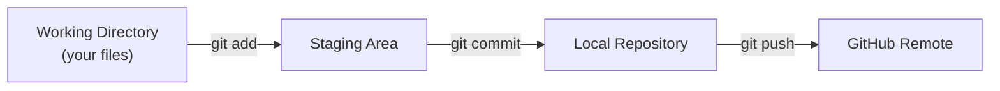

# Lab 01 — Your First Git Repository

## 1. Objective

By the end of this lab, you'll have initialized a Git repository, made your first commit, connected it to GitHub, and pushed your work.

---

## 2. Architecture Diagram



---

## 3. Prerequisites

- Git Bash installed (`git --version` should return a version)
- GitHub free account
- Git configured with your name and email (run once, globally):

```bash
git config --global user.name "Your Name"
git config --global user.email "you@example.com"
git config --global core.editor "code --wait"   # VS Code as editor
```

---

## 4. Setup

Open Git Bash. Create a fresh working directory:

```bash
mkdir ~/git-lab-01
cd ~/git-lab-01
```

---

## 5. Step-by-Step Tasks

### Task 1 — Initialize a Repository

```bash
git init
```

**What happened:** Git created a `.git` folder inside `git-lab-01`. That folder IS your repository.

```bash
ls -la
# You should see .git listed
```

### Task 2 — Check Status

```bash
git status
# On branch main (or master)
# No commits yet
# nothing to commit
```

### Task 3 — Create Your First File

```bash
echo "# My First Repo" > README.md
echo "This is a test project for learning Git." >> README.md
cat README.md
```

```bash
git status
# Untracked files:
#   README.md
```

### Task 4 — Stage the File

```bash
git add README.md
git status
# Changes to be committed:
#   new file: README.md
```

### Task 5 — Make Your First Commit

```bash
git commit -m "docs: add initial README"
git log --oneline
# abc123d (HEAD -> main) docs: add initial README
```

### Task 6 — Add More Files and Commit

```bash
echo "node_modules/" > .gitignore
echo ".env" >> .gitignore

git add .gitignore
git commit -m "chore: add .gitignore"

git log --oneline
# def456e (HEAD -> main) chore: add .gitignore
# abc123d docs: add initial README
```

### Task 7 — Connect to GitHub and Push

1. Create a new repository on GitHub named `git-lab-01` (make it public, don't initialize with README)
2. Copy the HTTPS URL
3. Run:

```bash
git remote add origin https://github.com/YOUR_USERNAME/git-lab-01.git
git remote -v
# origin  https://github.com/YOUR_USERNAME/git-lab-01.git (fetch)
# origin  https://github.com/YOUR_USERNAME/git-lab-01.git (push)

git push -u origin main
```

> 📸 Screenshot: GitHub repository page showing your two commits in the commit history

---

## 6. Validation

Run these and verify the output matches:

```bash
git log --oneline
# Two commits visible

git remote -v
# origin points to your GitHub repo

git status
# nothing to commit, working tree clean
```

---

## 7. Expected Output

```
$ git log --oneline
def456e (HEAD -> main, origin/main) chore: add .gitignore
abc123d docs: add initial README

$ git remote -v
origin  https://github.com/YOUR_USERNAME/git-lab-01.git (fetch)
origin  https://github.com/YOUR_USERNAME/git-lab-01.git (push)

$ git status
On branch main
Your branch is up to date with 'origin/main'.
nothing to commit, working tree clean
```

---

## 8. Troubleshooting

**`git push` asks for username/password repeatedly**
→ Set up a Personal Access Token. In GitHub: Settings → Developer settings → Personal access tokens → Tokens (classic) → Generate. Use the token as your password.

**"refusing to merge unrelated histories"**
→ You initialized GitHub with a README. Run: `git pull origin main --allow-unrelated-histories` then push again.

**"src refspec main does not match any"**
→ Your default branch may be named `master`. Run `git branch -m master main` first.

---

## 9. Cleanup

```bash
# The remote repo stays on GitHub for future labs
# To remove the local folder:
cd ~
rm -rf git-lab-01
```

---

## 10. Challenge Task

1. Make a third file (`notes.md`) with any content
2. Stage and commit it with a properly formatted commit message
3. Push it to GitHub
4. On GitHub, edit `README.md` directly in the browser (add one line)
5. Pull that change back to your local repo with `git pull`
6. Run `git log --oneline` and verify all commits are there

---

Next lab: [Lab 02 — Branching →](../lab-02-branching/README.md)
