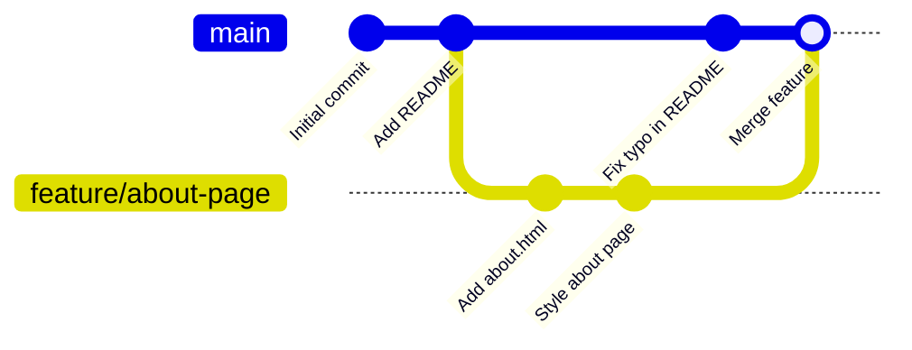

# Lab 02 — Branching

## 1. Objective

Create branches, switch between them, build a backup branch, work on a feature, and merge it back to main — keeping everything in sync.

---

## 2. Architecture Diagram



---

## 3. Prerequisites

- Git Bash open
- GitHub free account
- GitHub CLI (`gh`) installed and authenticated

---

## 4. Setup

```bash
# Create a fresh repo for this lab
mkdir ~/git-lab-02 && cd ~/git-lab-02
git init
echo "# My Project" > README.md
git add README.md
git commit -m "init: lab setup"
gh repo create git-lab-02 --public --push --source=.
```

---

## 5. Step-by-Step Tasks

### Task 1 — See Your Current Branches

```bash
git branch
# * main

git branch -a
# * main
#   remotes/origin/main
```

### Task 2 — Create a Feature Branch

```bash
git switch -c feature/about-page
git branch
# * feature/about-page
#   main
```

### Task 3 — Work on the Feature

```bash
cat > about.html << 'EOF'
<!DOCTYPE html>
<html>
<head><title>About</title></head>
<body>
  <h1>About This Project</h1>
  <p>A Git learning project.</p>
</body>
</html>
EOF

git add about.html
git commit -m "feat: add about page"

echo "<!-- mobile nav added -->" >> about.html
git add about.html
git commit -m "feat: add mobile navigation placeholder"

git log --oneline
# Two commits on feature/about-page
```

### Task 4 — Switch Back to Main

```bash
git switch main
ls
# about.html is GONE — it only exists on the feature branch
# Your files are safe, Git is just showing you the main snapshot

git switch feature/about-page
ls
# about.html is back
```

### Task 5 — Create a Backup Branch

```bash
# You're about to do something experimental — create a safety net
git branch backup/feature-about-before-experiment

git branch
# * feature/about-page
#   backup/feature-about-before-experiment
#   main
```

### Task 6 — Simulate a Problem

```bash
# Experimental change that goes wrong
echo "BROKEN CODE HERE" > about.html
git add about.html
git commit -m "experiment: trying something"

git log --oneline
# Something went wrong — restore from backup
git reset --hard backup/feature-about-before-experiment
git log --oneline
# Back to the two clean commits
```

### Task 7 — Sync Feature Branch with Main

While you were working on `feature/about-page`, your teammate pushed a change to `main`:

```bash
git switch main
echo "Updated contact info" >> README.md
git add README.md
git commit -m "docs: update contact info"

# Now bring that into your feature branch
git switch feature/about-page
git rebase main

git log --oneline --graph --all
```

### Task 8 — Merge Feature into Main

```bash
git switch main
git merge --no-ff feature/about-page -m "feat: merge about page feature"

git log --oneline --graph
# You should see the merge commit with both branch paths visible
```

### Task 9 — Push and Clean Up

```bash
git push origin main

# Delete the feature branch (it's merged)
git branch -d feature/about-page
git branch -d backup/feature-about-before-experiment

git branch
# * main
```

---

## 6. Validation

```bash
git log --oneline --graph
# Should show merge commit, feature commits, and main commits

ls
# about.html should be present on main now

git branch
# Only main remaining
```

---

## 7. Expected Output

```
$ git log --oneline --graph
*   abc123d (HEAD -> main, origin/main) feat: merge about page feature
|\
| * def456e feat: add mobile navigation placeholder
| * ghi789f feat: add about page
* | jkl012a docs: update contact info
|/
* mno345b chore: add .gitignore
* pqr678c docs: add initial README

$ git branch
* main
```

---

## 8. Troubleshooting

**"Cannot delete branch — not fully merged"**
→ You're trying to delete a branch with uncommitted or unmerged work. Either merge it first, or use `git branch -D` if you're sure you want to discard it.

**Files look wrong after switching branches**
→ Run `git status`. If there are uncommitted changes, stash them first: `git stash`, switch branch, `git stash pop`.

**Rebase has conflicts**
→ Fix the conflict in the file, `git add <file>`, `git rebase --continue`.

---

## 9. Cleanup

```bash
cd ~/git-lab-02
git switch main
git push origin main

# Delete the GitHub repo when done
gh repo delete md-sarowar-alam/git-lab-02 --yes
cd ~ && rm -rf git-lab-02
```

---

## 10. Challenge Task

1. Create a branch `feature/contact-page` from main
2. Add a `contact.html` file with a simple contact form in HTML
3. Make at least 3 commits on this branch
4. Meanwhile, add a `LICENSE` file to `main` directly
5. Rebase `feature/contact-page` onto the updated `main`
6. Merge `feature/contact-page` into `main` with `--no-ff`
7. Push everything to GitHub and verify the graph on GitHub's commit history

---

Previous: [Lab 01 →](../lab-01-version-control/README.md) · Next: [Lab 03 →](../lab-03-merge-conflicts/README.md)
