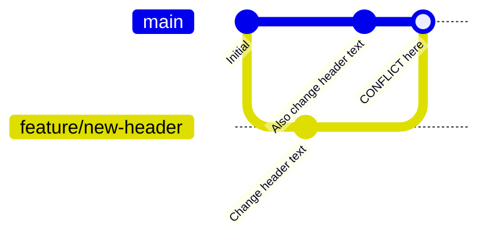

# Lab 03 — Merge Conflicts & Resolution

## 1. Objective

Intentionally create a merge conflict, understand exactly what Git is telling you, and resolve it manually. By the end, conflicts won't feel scary — just a decision to make.

---

## 2. Architecture Diagram



Both branches changed the same line — Git can't decide. You decide.

---

## 3. Prerequisites

- Completed Lab 02
- `git-lab-01` repo open in Git Bash
- Clean working tree (`git status` shows nothing to commit)

---

## 4. Setup

```bash
cd ~/git-lab-01
git switch main
git pull origin main
```

---

## 5. Step-by-Step Tasks

### Task 1 — Set Up the Conflict Scenario

Create a shared file that both branches will modify:

```bash
cat > index.html << 'EOF'
<!DOCTYPE html>
<html>
<head><title>Home</title></head>
<body>
  <h1>Welcome to Our Site</h1>
  <p>This is the home page.</p>
</body>
</html>
EOF

git add index.html
git commit -m "feat: add home page"
```

### Task 2 — Create a Feature Branch and Change the Heading

```bash
git switch -c feature/new-header

# Edit index.html — change the h1 line:
sed -i 's/<h1>Welcome to Our Site<\/h1>/<h1>Welcome to DevOps Academy<\/h1>/' index.html

cat index.html   # verify the change

git add index.html
git commit -m "feat: update header for rebrand"
```

### Task 3 — Back on Main, Make a Conflicting Change

```bash
git switch main

# A different person also changed the same line:
sed -i 's/<h1>Welcome to Our Site<\/h1>/<h1>Hello from the Team<\/h1>/' index.html

git add index.html
git commit -m "feat: update header text"
```

### Task 4 — Attempt the Merge

```bash
git merge feature/new-header
```

You'll see:
```
Auto-merging index.html
CONFLICT (content): Merge conflict in index.html
Automatic merge failed; fix conflicts and then commit the result.
```

### Task 5 — Understand the Conflict Markers

```bash
cat index.html
```

You'll see:
```html
<!DOCTYPE html>
<html>
<head><title>Home</title></head>
<body>
<<<<<<< HEAD
  <h1>Hello from the Team</h1>
=======
  <h1>Welcome to DevOps Academy</h1>
>>>>>>> feature/new-header
  <p>This is the home page.</p>
</body>
</html>
```

- `<<<<<<< HEAD` to `=======` = your current branch (main) version
- `=======` to `>>>>>>> feature/new-header` = incoming branch version
- You must choose (or combine) and remove all three marker lines

### Task 6 — Resolve the Conflict

Open `index.html` and edit it to the resolved state. For this lab, combine both intentions:

```bash
cat > index.html << 'EOF'
<!DOCTYPE html>
<html>
<head><title>Home</title></head>
<body>
  <h1>Welcome to DevOps Academy — Hello from the Team</h1>
  <p>This is the home page.</p>
</body>
</html>
EOF
```

### Task 7 — Mark as Resolved and Complete the Merge

```bash
git status
# Changes to be committed: modified index.html
# (but still shows as conflicted)

git add index.html

git status
# All conflicts fixed but you are still merging.
# Use "git commit" to conclude merge.

git commit
# Git opens editor with a pre-filled merge commit message — save and close
```

### Task 8 — Verify the Result

```bash
git log --oneline --graph
cat index.html
# Should show your resolved version with no conflict markers
```

### Task 9 — What If You Want to Abort Mid-Conflict?

```bash
# If you ever get into a conflict and want to go back to before the merge:
git merge --abort

# This resets everything to the state before you ran git merge
```

---

## 6. Validation

```bash
grep -c "<<<<<<\|>>>>>>>\|=======" index.html
# Should return 0 — no conflict markers remain

git log --oneline
# Merge commit visible at the top

git status
# nothing to commit, working tree clean
```

---

## 7. Expected Output

```
$ git log --oneline --graph
*   abc123d (HEAD -> main) Merge branch 'feature/new-header'
|\
| * def456e feat: update header for rebrand
* | ghi789f feat: update header text
|/
* jkl012a feat: add home page

$ cat index.html
<!DOCTYPE html>
<html>
<head><title>Home</title></head>
<body>
  <h1>Welcome to DevOps Academy — Hello from the Team</h1>
  <p>This is the home page.</p>
</body>
</html>
```

---

## 8. Troubleshooting

**"You have unmerged paths"**
→ You forgot to `git add` the resolved file before committing. Stage it first.

**Accidentally committed conflict markers**
→ `git revert HEAD` to undo the commit, fix the file, recommit.

**VS Code shows Accept Current / Accept Incoming buttons**
→ Those buttons automatically remove the conflict markers and keep the chosen version. Use them if you prefer a GUI approach.

---

## 9. Cleanup

```bash
git branch -d feature/new-header
git push origin main
```

---

## 10. Challenge Task

Create a scenario with **three files in conflict** and resolve all three in a single merge commit:

1. Create `styles.css`, `scripts.js`, and `config.json` on `main` with some content in each
2. Create branch `feature/redesign`
3. Modify the same lines in all three files on both `feature/redesign` and `main`
4. Merge and resolve all three conflicts
5. Verify with `grep` that no conflict markers remain in any file

---

Previous: [Lab 02 →](../lab-02-branching/README.md) · Next: [Lab 04 →](../lab-04-rebase/README.md)
