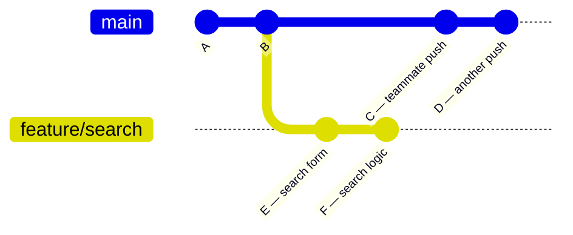
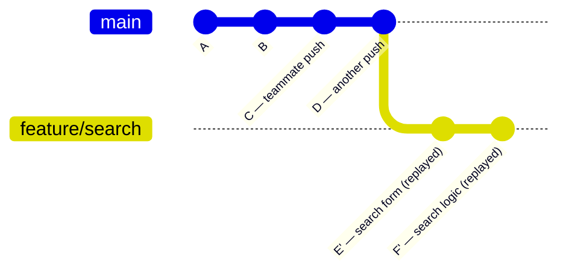

# Lab 04 — Rebase a Feature Branch

## 1. Objective

Simulate a real team scenario where `main` moves ahead while you're working on a feature branch. Use rebase to replay your commits on top of the latest `main`, then merge with a clean linear history. Also practice interactive rebase to clean up messy commits.

---

## 2. Architecture Diagram



After rebase:



---

## 3. Prerequisites

- Git Bash open
- GitHub free account
- GitHub CLI (`gh`) installed and authenticated

---

## 4. Setup

```bash
# Create a fresh repo for this lab
mkdir ~/git-lab-04 && cd ~/git-lab-04
git init
echo "# My Project" > README.md
git add README.md
git commit -m "init: lab setup"
gh repo create git-lab-04 --public --push --source=.
```

---

## 5. Step-by-Step Tasks

### Task 1 — Start a Feature Branch

```bash
git switch -c feature/search
```

### Task 2 — Make Messy Commits (realistic)

```bash
echo "<input type='search' placeholder='Search...'>" >> index.html
git add index.html
git commit -m "WIP search bar"

echo "/* search styles */" >> index.html
git add index.html
git commit -m "add search styles i think"

echo "<!-- search complete -->" >> index.html
git add index.html
git commit -m "fix typo"

echo "<!-- final search -->" >> index.html
git add index.html
git commit -m "feat: complete search component"

git log --oneline
# 4 commits, some messy
```

### Task 3 — Simulate Main Moving Ahead

```bash
git switch main

cat >> README.md << 'EOF'

## Team Updates
- Search feature in progress
- Contact page coming soon
EOF

git add README.md
git commit -m "docs: add team updates section"

echo "body { margin: 0; }" >> index.html
git add index.html
git commit -m "style: remove default body margin"

git log --oneline
# 2 new commits on main
```

### Task 4 — Rebase the Feature Branch onto Main

```bash
git switch feature/search

git log --oneline --graph --all
# You'll see the diverged history

git rebase main
# Git replays your 4 commits on top of main's 2 new commits

git log --oneline --graph --all
# feature/search is now ahead of main — linear history, no fork
```

If a conflict occurs during rebase:
```bash
# Fix the conflict in the file...
git add <conflicted-file>
git rebase --continue
```

### Task 5 — Interactive Rebase to Clean Up Commits

Now squash those 4 messy commits into one meaningful commit:

```bash
git rebase -i HEAD~4
```

Git opens an editor:
```
pick abc123d WIP search bar
pick def456e add search styles i think
pick ghi789f fix typo
pick jkl012a feat: complete search component
```

Change it to:
```
pick abc123d WIP search bar
squash def456e add search styles i think
fixup ghi789f fix typo
fixup jkl012a feat: complete search component
```

Save and close. Git opens a second editor for the final commit message. Write:
```
feat: add search component with styles
```

Save and close.

```bash
git log --oneline
# One clean commit instead of four messy ones
```

### Task 6 — Merge into Main

```bash
git switch main
git merge --no-ff feature/search -m "feat: merge search component"

git log --oneline --graph
```

### Task 7 — Push

```bash
git push origin main
git branch -d feature/search
```

---

## 6. Validation

```bash
git log --oneline --graph
# Merge commit visible, only ONE commit from feature/search (squashed)

git log --oneline | head -5
# Clean commit messages — no "WIP" or "fix typo" visible

git status
# nothing to commit
```

---

## 7. Expected Output

```
$ git log --oneline --graph
*   abc123d (HEAD -> main, origin/main) feat: merge search component
|\
| * def456e feat: add search component with styles
* | ghi789f style: remove default body margin
* | jkl012a docs: add team updates section
|/
* mno345b ...previous commits
```

---

## 8. Troubleshooting

**"conflict after rebase --continue"**
→ Multiple commits may conflict one at a time. Fix each conflict, `git add`, `git rebase --continue` after each one.

**Interactive rebase editor is confusing**
→ Change only the command word at the start of each line (`pick` → `squash`, etc.). Don't change the commit hashes or messages yet (you'll edit the final message in a second editor).

**"detached HEAD" after rebase**
→ Run `git switch feature/search` to reattach.

---

## 9. Cleanup

```bash
cd ~/git-lab-04
git branch -d feature/search 2>/dev/null || true
git push origin main

# Delete the GitHub repo when done
gh repo delete md-sarowar-alam/git-lab-04 --yes
cd ~ && rm -rf git-lab-04
```

---

## 10. Challenge Task

1. Create `feature/footer` with 5 commits (make at least 2 of them "WIP" or "fix" commits)
2. Add 3 commits to `main` while you work on the feature
3. Rebase `feature/footer` onto `main` (resolve any conflicts)
4. Use interactive rebase to squash down to 2 clean commits
5. Merge into `main` and push
6. Run `git log --oneline --graph` and verify the history is clean

---

Previous: [Lab 03 →](../lab-03-merge-conflicts/README.md) · Next: [Lab 05 →](../lab-05-pull-requests/README.md)
