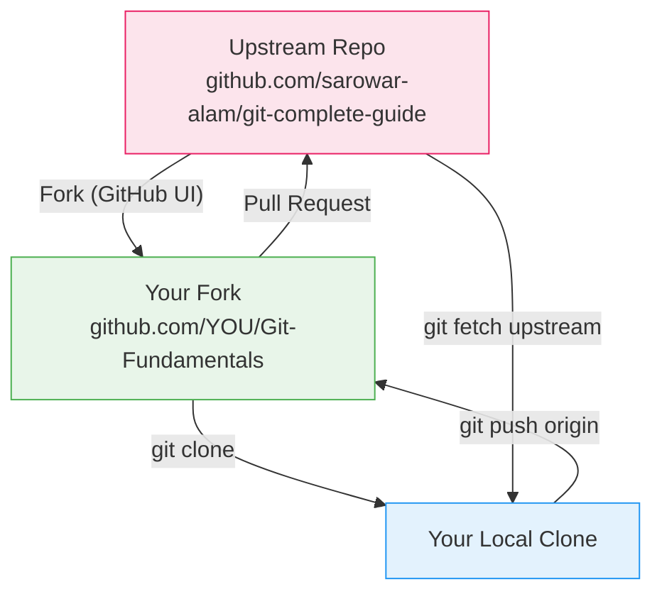

# Lab 05 — Fork, Upstream Sync & Pull Request

## 1. Objective

Fork a public repository, clone your fork, add the upstream remote, make a change on a feature branch, keep your fork in sync with upstream, and open a pull request.

---

## 2. Architecture Diagram



---

## 3. Prerequisites

- GitHub free account
- Git Bash open
- Internet connection

---

## 4. Setup

You'll fork the main Git-Fundamentals repository for this lab.

---

## 5. Step-by-Step Tasks

### Task 1 — Fork the Repository

1. Go to: `https://github.com/sarowar-alam/git-complete-guide`
2. Click **Fork** (top-right)
3. Select your account as the destination
4. GitHub creates: `github.com/YOUR_USERNAME/Git-Fundamentals`

> 📸 Screenshot: Fork button on the repository page and the fork destination screen

### Task 2 — Clone Your Fork

```bash
cd ~
git clone https://github.com/YOUR_USERNAME/Git-Fundamentals.git git-lab-05
cd git-lab-05

git remote -v
# origin  https://github.com/YOUR_USERNAME/Git-Fundamentals.git (fetch)
# origin  https://github.com/YOUR_USERNAME/Git-Fundamentals.git (push)
```

### Task 3 — Add the Upstream Remote

```bash
git remote add upstream https://github.com/sarowar-alam/git-complete-guide.git

git remote -v
# origin    https://github.com/YOUR_USERNAME/Git-Fundamentals.git (fetch)
# origin    https://github.com/YOUR_USERNAME/Git-Fundamentals.git (push)
# upstream  https://github.com/sarowar-alam/git-complete-guide.git (fetch)
# upstream  https://github.com/sarowar-alam/git-complete-guide.git (push)
```

### Task 4 — Create a Feature Branch

```bash
git switch -c feature/add-my-note
```

### Task 5 — Make a Meaningful Change

Create a new file in the exercises folder with your notes:

```bash
mkdir -p exercises/beginner
cat > exercises/beginner/my-notes.md << EOF
# My Git Notes

## Things I learned today
- Forking creates a copy under my account
- upstream is the original repo
- I can sync my fork with: git fetch upstream && git merge upstream/main
- Pull requests go from my fork → the upstream repo
EOF

git add exercises/beginner/my-notes.md
git commit -m "docs: add personal git learning notes"
```

### Task 6 — Sync Your Fork with Upstream

Before opening the PR, make sure your branch is up to date:

```bash
git fetch upstream

git log upstream/main --oneline -5
# See what's changed upstream

git switch main
git merge upstream/main
git push origin main

git switch feature/add-my-note
git rebase upstream/main

# If conflicts: fix → git add → git rebase --continue
```

### Task 7 — Push Your Feature Branch to Your Fork

```bash
git push origin feature/add-my-note
```

### Task 8 — Open a Pull Request

1. Go to `github.com/YOUR_USERNAME/Git-Fundamentals`
2. GitHub shows a banner: **"Compare & pull request"** for `feature/add-my-note`
3. Click it
4. Set:
   - **Base repository:** `sarowar-alam/git-complete-guide`
   - **Base branch:** `main`
   - **Head repository:** `YOUR_USERNAME/Git-Fundamentals`
   - **Compare branch:** `feature/add-my-note`
5. Title: `docs: add personal git learning notes`
6. Description: explain what you added and why
7. Click **Create pull request**

> 📸 Screenshot: Pull request creation form showing base and compare dropdowns

### Task 9 — Inspect the PR

On the PR page, explore:
- **Files changed** tab — see your diff
- **Commits** tab — see your commit
- Add a comment to your own PR: "Ready for review"

---

## 6. Validation

```bash
git remote -v
# Both origin and upstream configured

git log --oneline
# Your feature commit visible

git branch
# feature/add-my-note exists
```

Also verify on GitHub that your PR is visible at:
`github.com/sarowar-alam/git-complete-guide/pulls`

---

## 7. Expected Output

```
$ git remote -v
origin    https://github.com/YOUR_USERNAME/Git-Fundamentals.git (fetch)
origin    https://github.com/YOUR_USERNAME/Git-Fundamentals.git (push)
upstream  https://github.com/sarowar-alam/git-complete-guide.git (fetch)
upstream  https://github.com/sarowar-alam/git-complete-guide.git (push)

$ git log --oneline
abc123d (HEAD -> feature/add-my-note, origin/feature/add-my-note) docs: add personal git learning notes
...
```

---

## 8. Troubleshooting

**"Can't fork — fork already exists"**
→ You already forked it. Go to `github.com/YOUR_USERNAME/Git-Fundamentals` directly.

**PR shows "Can't automatically merge"**
→ Your branch has conflicts with upstream. Run `git rebase upstream/main` on your feature branch, resolve conflicts, force-push with `git push --force-with-lease origin feature/add-my-note`.

**"Permission denied" on upstream push**
→ You can't push to upstream — only to your fork. `git push origin` (not `git push upstream`).

---

## 9. Cleanup

```bash
# After the PR is merged (or closed), clean up:
git switch main
git fetch upstream
git merge upstream/main
git push origin main
git branch -d feature/add-my-note
git push origin --delete feature/add-my-note
```

---

## 10. Challenge Task

1. Find any open-source project on GitHub that accepts contributions
2. Fork it, read the `CONTRIBUTING.md` file
3. Find a tiny improvement (fix a typo in docs, add a missing semicolon)
4. Open a real pull request to that project
5. Screenshot the PR URL and add it to your `my-notes.md`

---

Previous: [Lab 04 →](../lab-04-rebase/README.md) · Next: [Lab 06 →](../lab-06-branch-protection/README.md)
