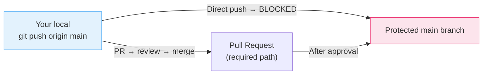

# Lab 06 — Branch Protection Rules

## 1. Objective

Set up branch protection rules on a public GitHub repository (free tier). Test that direct pushes are blocked, force pushes are rejected, and pull requests are required.

> **Free tier note:** Branch protection rules only work on **public** repositories with a free GitHub account. If your repo is private, make it public for this lab (you can make it private again after).

---

## 2. Architecture Diagram



---

## 3. Prerequisites

- `git-lab-01` repo on GitHub (public)
- GitHub free account
- Git Bash open

---

## 4. Setup

Make sure your repo is public:
```
GitHub → Your repo → Settings → Danger Zone → Change visibility → Public
```

---

## 5. Step-by-Step Tasks

### Task 1 — Enable Branch Protection

1. Go to your `git-lab-01` repository on GitHub
2. Click **Settings** → **Branches** → **Add branch ruleset** (or **Add rule** on older UI)
3. Set **Branch name pattern:** `main`
4. Enable the following:
   - ✓ **Require a pull request before merging**
   - ✓ **Required approvals:** 1
   - ✓ **Dismiss stale reviews when new commits are pushed**
   - ✓ **Block force pushes**
   - ✓ **Restrict deletions**
5. Click **Create** (or **Save changes**)

> 📸 Screenshot: GitHub branch protection settings page with the rules checked

### Task 2 — Test: Try to Push Directly

```bash
cd ~/git-lab-01
git switch main

echo "# Direct push test" >> README.md
git add README.md
git commit -m "test: try direct push to protected main"

git push origin main
```

You should see:
```
remote: error: GH006: Protected branch update failed for refs/heads/main.
remote: error: At least 1 approving review is required by reviewers with write access.
To https://github.com/md-sarowar-alam/git-lab-01.git
 ! [remote rejected] main -> main (protected branch hook declined)
error: failed to push some refs
```

### Task 3 — Undo the Local Commit (it was rejected)

```bash
git reset --soft HEAD~1
git status
# Changes are staged, ready to be put on a feature branch instead
```

### Task 4 — Use the Correct Path (Feature Branch + PR)

```bash
git switch -c feature/readme-update

# The staged change is already here
git commit -m "docs: add branch protection test note"

git push origin feature/readme-update
```

Now open a PR:
1. Go to GitHub → your repo
2. Click **Compare & pull request** for `feature/readme-update`
3. Set base branch: `main`
4. Open the PR

### Task 5 — Test: Try to Force Push

```bash
git switch main
git reset --hard HEAD~2    # move main back locally
git push --force origin main
```

You should see:
```
remote: error: GH006: Protected branch update failed for refs/heads/main.
remote: error: Cannot force-push to this branch.
```

### Task 6 — Test: Try to Delete the Branch

```bash
git push origin --delete main
```

You should see:
```
remote: error: GH006: Protected branch update failed for refs/heads/main.
remote: error: Cannot delete this branch.
```

### Task 7 — Restore Main

```bash
git pull origin main
# This resets your local main to match the remote (protected) main
```

### Task 8 — Merge the PR

Since you're the only person on this repo and you need 1 approval:
1. Go to the PR on GitHub
2. Under "Reviewers" — you can't review your own PR by default in a personal repo
3. For this lab: temporarily lower the required approvals to 0, merge the PR, then restore it to 1

OR — invite a classmate, have them approve the PR, then merge it.

---

## 6. Validation

```bash
# Confirm direct push is still blocked
echo "test" >> README.md
git add README.md
git commit -m "test: should be blocked"
git push origin main
# Should fail with protection error

git reset --soft HEAD~1  # clean up
```

---

## 7. Expected Output

```
# Task 2 output:
remote: error: GH006: Protected branch update failed for refs/heads/main.
remote: error: At least 1 approving review is required.
! [remote rejected] main -> main (protected branch hook declined)

# Task 5 output:
remote: error: GH006: Protected branch update failed for refs/heads/main.
remote: error: Cannot force-push to this branch.

# Task 6 output:
remote: error: GH006: Protected branch update failed for refs/heads/main.
remote: error: Cannot delete this branch.
```

---

## 8. Troubleshooting

**Rules not applying (direct push succeeds)**
→ Check that the branch pattern is exactly `main` (not `*` or `master`). Verify the rules are saved.

**"You must be a collaborator to merge"**
→ You're not a collaborator on a repo you forked — this lab should be on a repo you own.

**Can't review your own PR**
→ Temporarily set required approvals to 0, merge the PR, then set it back to 1.

---

## 9. Cleanup

```bash
git branch -d feature/readme-update
git push origin --delete feature/readme-update

# Branch protection rules stay active (that's the point)
```

---

## 10. Challenge Task

1. Add a `CODEOWNERS` file to your repo:
   ```
   # CODEOWNERS
   /README.md  @md-sarowar-alam
   ```
2. Push it to a feature branch, merge via PR
3. Open a new PR that touches `README.md` — verify that you're automatically added as a required reviewer
4. Add a status check requirement to the branch protection rule (use any check name)
5. Open a PR and observe that the merge is blocked waiting for the status check

---

Previous: [Lab 05 →](../lab-05-pull-requests/README.md) · Next: [Lab 07 →](../lab-07-tags-releases/README.md)
