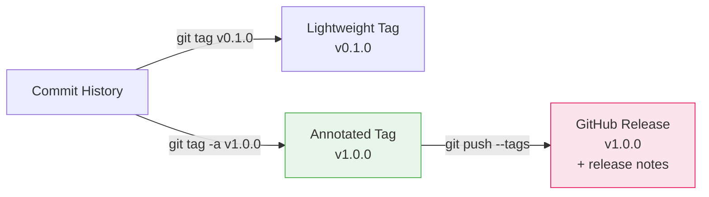

# Lab 07 — Tags & GitHub Releases

## 1. Objective

Create lightweight and annotated tags, push them to GitHub, create a GitHub Release, and practice semantic versioning with a real project.

---

## 2. Architecture Diagram



---

## 3. Prerequisites

- Git Bash open
- GitHub free account
- GitHub CLI (`gh`) installed and authenticated

---

## 4. Setup

```bash
# Create a fresh repo with several commits (tags need history)
mkdir ~/git-lab-07 && cd ~/git-lab-07
git init
echo "# My Project" > README.md && git add . && git commit -m "init: lab setup"
echo "version: 0.1.0" > version.txt && git add . && git commit -m "feat: add version file"
echo "## Changelog" > CHANGELOG.md && git add . && git commit -m "docs: add changelog"
gh repo create git-lab-07 --public --push --source=.

git log --oneline
# Should show 3 commits
```

---

## 5. Step-by-Step Tasks

### Task 1 — Create a Lightweight Tag

```bash
# Tag the current commit as version 0.1.0
git tag v0.1.0

git tag
# v0.1.0

git show v0.1.0
# Shows the commit it points to (no tag metadata — just the commit)
```

### Task 2 — Create an Annotated Tag

```bash
git tag -a v1.0.0 -m "First stable release

Features:
- Home page
- About page
- Contact page
- Search component"

git show v1.0.0
# Shows tag object: tagger, date, message, then the commit
```

### Task 3 — Tag a Past Commit

```bash
git log --oneline
# Find the hash of your second commit, e.g., abc123d

git tag -a v0.0.1 abc123d -m "Initial working version"

git tag
# v0.0.1
# v0.1.0
# v1.0.0
```

### Task 4 — Push Tags to GitHub

```bash
# Tags are not pushed with git push by default
git push origin main
# Tags are NOT included ^^

# Push all tags
git push origin --tags

git tag -l
# Verify all three tags exist locally and on GitHub
```

> 📸 Screenshot: GitHub repository page showing the Tags section with v0.0.1, v0.1.0, v1.0.0

### Task 5 — Create a GitHub Release

1. Go to your repository on GitHub
2. Click **Releases** (right sidebar or **Code** tab)
3. Click **Draft a new release**
4. Choose tag: `v1.0.0`
5. Release title: `v1.0.0 — First Stable Release`
6. Release notes:
   ```markdown
   ## What's in this release

   ### New features
   - Home page with navigation
   - About page
   - Contact page
   - Search component

   ### How to use
   Clone the repo and open `index.html` in your browser.
   ```
7. Click **Publish release**

> 📸 Screenshot: GitHub Releases page showing published v1.0.0

### Task 6 — Add a Patch Release

```bash
# Fix a typo in README
sed -i 's/learning Git/learning Git and GitHub/' README.md
git add README.md
git commit -m "docs: fix typo in README"

# SemVer: bug fix = PATCH bump (1.0.0 → 1.0.1)
git tag -a v1.0.1 -m "Patch: fix README typo"
git push origin main --follow-tags
# --follow-tags pushes commits AND annotated tags
```

### Task 7 — List and Filter Tags

```bash
# All tags
git tag

# Filter by pattern
git tag -l "v1.*"
# v1.0.0
# v1.0.1

# Find nearest tag from current commit
git describe
# v1.0.1 (or v1.0.1-0-gabcdef if you're exactly on a tag)
```

### Task 8 — Check Out a Tag (inspect old state)

```bash
git checkout v0.1.0
# You're in detached HEAD state

git log --oneline
# History only up to the v0.1.0 commit

# Go back to main
git switch main
```

---

## 6. Validation

```bash
git tag
# Should show: v0.0.1, v0.1.0, v1.0.0, v1.0.1

git describe
# Should return the nearest tag

# Check tags on remote
git ls-remote --tags origin
```

---

## 7. Expected Output

```
$ git tag
v0.0.1
v0.1.0
v1.0.0
v1.0.1

$ git describe
v1.0.1

$ git show v1.0.0
tag v1.0.0
Tagger: Your Name <you@example.com>
Date:   Sat Jun 21 12:00:00 2025 +0600

First stable release
...
```

---

## 8. Troubleshooting

**Tags not showing on GitHub**
→ You pushed commits but not tags. Run `git push origin --tags`.

**"tag already exists"**
→ `git tag -d v1.0.0` to delete the local tag, then recreate.

**"v1.0.0 is not a valid tag" when creating release**
→ The tag wasn't pushed to GitHub. Check with `git ls-remote --tags origin`.

---

## 9. Cleanup

Tags are permanent references — don't delete them unless intentional:

```bash
# If you need to delete a tag:
git tag -d v0.0.1                    # local
git push origin --delete v0.0.1     # remote
```

---

## 10. Challenge Task

1. Create a `CHANGELOG.md` file documenting all changes from v0.0.1 to v1.0.1
2. Commit it and create tag `v1.1.0`
3. Create a GitHub release for v1.1.0 using the `CHANGELOG.md` content as the release notes
4. Use `git describe --tags --abbrev=0` in a bash command to print the current version

---

Previous: [Lab 06 →](../lab-06-branch-protection/README.md) · Next: [Lab 08 →](../lab-08-stash-reset-revert/README.md)
