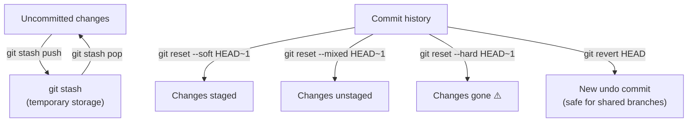

# Lab 08 — Stash, Reset & Revert

## 1. Objective

Use stash to save and restore work-in-progress, use reset in all three modes (`--soft`, `--mixed`, `--hard`) to understand what each one does, and use revert to safely undo a pushed commit without rewriting history.

---

## 2. Architecture Diagram



---

## 3. Prerequisites

- `git-lab-01` repo with several commits
- Git Bash open

---

## 4. Setup

```bash
cd ~/git-lab-01
git switch main
git pull origin main
```

---

## 5. Step-by-Step Tasks

### Part A — Stash

### Task 1 — Start Working, Then Get Interrupted

```bash
# You're mid-feature when an urgent bug comes in
echo "<footer>Site Footer v1</footer>" >> index.html
echo "/* footer styles */" >> index.html  # Oops, wrong file
git status
# modified: index.html (twice — two changes)
```

### Task 2 — Stash Your Work

```bash
git stash push -m "WIP: adding footer to index"

git status
# nothing to commit, working tree clean
# Your working directory is clean — stash saved it

ls
# Files look like before your changes
```

### Task 3 — Handle the Urgent Bug

```bash
git switch -c hotfix/urgent-fix
echo "<!-- urgent fix applied -->" >> README.md
git add README.md
git commit -m "fix: apply urgent hotfix"
git switch main
git merge hotfix/urgent-fix
git branch -d hotfix/urgent-fix
```

### Task 4 — Restore Your Stashed Work

```bash
git stash list
# stash@{0}: On main: WIP: adding footer to index

git stash pop

git status
# modified: index.html — your changes are back
```

### Task 5 — Multiple Stashes

```bash
git stash push -m "footer WIP"

# Switch to another branch, do something, stash that too
git switch -c feature/nav
echo "<nav>Nav bar</nav>" >> index.html
git stash push -m "nav WIP"

git stash list
# stash@{0}: On feature/nav: nav WIP
# stash@{1}: On main: footer WIP

# Apply a specific stash
git stash apply stash@{1}   # apply footer WIP

git stash drop stash@{1}    # remove it from the list

git switch main
git stash pop               # apply nav WIP to main (just for practice)
git stash clear             # clear all remaining stashes
```

---

### Part B — Reset

### Task 6 — Make Three Test Commits

```bash
git switch main
echo "line 1" >> notes.txt && git add notes.txt && git commit -m "test: line 1"
echo "line 2" >> notes.txt && git add notes.txt && git commit -m "test: line 2"
echo "line 3" >> notes.txt && git add notes.txt && git commit -m "test: line 3"

git log --oneline | head -4
```

### Task 7 — Reset --soft (undo commit, keep changes staged)

```bash
git reset --soft HEAD~1

git status
# Changes to be committed: modified notes.txt  ← STAGED
git log --oneline | head -3
# "test: line 3" commit is GONE
cat notes.txt
# line 3 is still in the file
```

### Task 8 — Reset --mixed (undo commit, unstage changes)

```bash
git reset HEAD~1    # --mixed is default

git status
# Changes not staged for commit: modified notes.txt  ← UNSTAGED
git log --oneline | head -3
# "test: line 2" commit is GONE too
cat notes.txt
# line 2 and 3 are still in the file
```

### Task 9 — Reset --hard (undo commit AND discard changes)

```bash
git reset --hard HEAD~1

git status
# nothing to commit, working tree clean
git log --oneline | head -3
# "test: line 1" commit is GONE
cat notes.txt
# line 1 is GONE too — hard reset discards changes
```

---

### Part C — Revert

### Task 10 — Commit Something You Regret

```bash
echo "BUG: this breaks everything" >> index.html
git add index.html
git commit -m "feat: accidental bad change"
git push origin main
# Now it's on GitHub — you can't reset safely
```

### Task 11 — Revert It Safely

```bash
git revert HEAD

# Git opens editor with a pre-filled message:
# Revert "feat: accidental bad change"
# Save and close.

git log --oneline | head -3
# New "Revert" commit at the top — original commit still in history

git push origin main
# Safe to push — no history rewrite
```

---

## 6. Validation

```bash
git log --oneline | head -5
# Revert commit visible at top

git status
# nothing to commit

grep -v "BUG" index.html
# The bad line should not appear
```

---

## 7. Expected Output

```
$ git log --oneline | head -3
abc123d (HEAD -> main) Revert "feat: accidental bad change"
def456e feat: accidental bad change
ghi789f ...previous commit

$ git stash list
(empty — all stashes were cleaned up)

$ git status
On branch main
nothing to commit, working tree clean
```

---

## 8. Troubleshooting

**Stash pop has conflicts**
→ The stashed changes conflict with your current state. Resolve like a merge conflict: edit the file, `git add`, `git stash drop stash@{0}`.

**`git reset --hard` and you want the changes back**
→ Check `git reflog` — the commit still exists for 90 days. `git reset --hard HEAD@{1}` to recover.

**Revert opens a text editor and you don't know how to save**
→ In Vim: press `Escape`, then type `:wq` and press Enter. In VS Code: just close the tab.

---

## 9. Cleanup

```bash
git push origin main
git stash clear
git branch -D feature/nav 2>/dev/null || true
```

---

## 10. Challenge Task

1. Create 5 commits with messages "step 1" through "step 5"
2. Use `git reset --soft HEAD~3` to uncommit the last 3 (keeping changes staged)
3. Create a single clean commit replacing those 3: `feat: combine steps 3-5`
4. Push to GitHub
5. Then deliberately push a "bad" commit and practice reverting it without anyone (teammates) noticing a rewrite

---

Previous: [Lab 07 →](../lab-07-tags-releases/README.md) · Next: [Lab 09 →](../lab-09-history-recovery/README.md)
