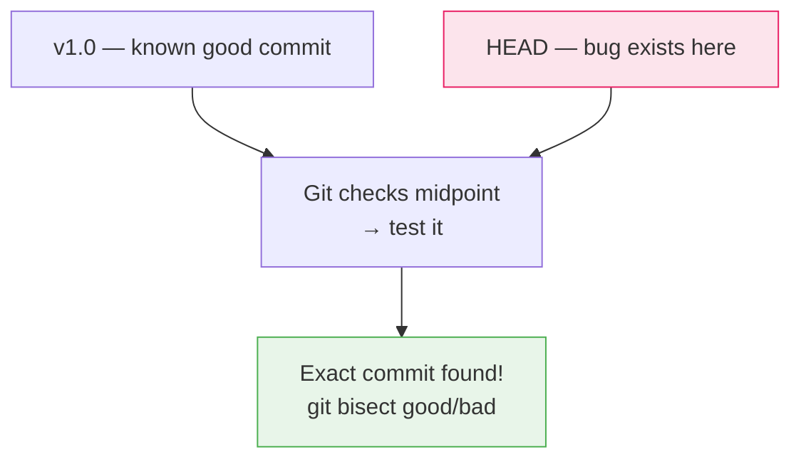

# Lab 09 — History Recovery with Reflog & Bisect

## 1. Objective

Use `git reflog` to recover commits after an accidental `reset --hard`, and use `git bisect` to find exactly which commit introduced a bug — in 10 steps or fewer across 20 commits.

---

## 2. Architecture Diagram



---

## 3. Prerequisites

- `git-lab-01` repo
- Git Bash open

---

## 4. Setup

```bash
cd ~/git-lab-01
git switch main
git pull origin main
```

---

## 5. Step-by-Step Tasks

### Part A — Reflog Recovery

### Task 1 — Make Commits You're About to "Lose"

```bash
echo "important feature A" >> features.txt
git add features.txt
git commit -m "feat: add feature A"

echo "important feature B" >> features.txt
git add features.txt
git commit -m "feat: add feature B"

echo "important feature C" >> features.txt
git add features.txt
git commit -m "feat: add feature C"

git log --oneline | head -4
# Remember these 3 commits
```

### Task 2 — Simulate an Accident

```bash
# You thought you were doing something safe but weren't
git reset --hard HEAD~3

git log --oneline | head -4
# "feat: add feature A/B/C" are ALL GONE from the log
cat features.txt
# features.txt may not even exist anymore
```

### Task 3 — Recover with Reflog

```bash
git reflog
# HEAD@{0}: reset: moving to HEAD~3
# HEAD@{1}: commit: feat: add feature C     ← THERE IT IS
# HEAD@{2}: commit: feat: add feature B
# HEAD@{3}: commit: feat: add feature A
```

```bash
# Recover all 3 commits
git reset --hard HEAD@{1}

git log --oneline | head -4
# All 3 commits are back!

cat features.txt
# Content restored
```

### Task 4 — Recover a Deleted Branch

```bash
# Create and delete a branch
git switch -c feature/secret-work
echo "top secret feature" > secret.txt
git add secret.txt
git commit -m "feat: add secret feature"

git switch main
git branch -D feature/secret-work   # force delete

# The branch is gone — but the commit still exists in reflog
git reflog | head -10
# HEAD@{1}: commit: feat: add secret feature

# Find the commit hash and recreate the branch
LOST_HASH=$(git reflog | grep "feat: add secret feature" | awk '{print $1}')
git branch feature/recovered $LOST_HASH

git switch feature/recovered
cat secret.txt
# "top secret feature" — recovered!

git switch main
git branch -D feature/recovered    # cleanup
```

---

### Part B — Bisect

### Task 5 — Create a History with a Bug Hidden in It

This creates 10 commits where commit #7 introduces a bug:

```bash
git switch main

for i in {1..10}; do
  echo "Feature $i" >> app.log
  git add app.log

  if [ $i -eq 7 ]; then
    echo "BUG_INTRODUCED=true" >> app.log
    git add app.log
    git commit -m "feat: add feature $i (CONTAINS BUG)"
  else
    git commit -m "feat: add feature $i"
  fi
done

git log --oneline | head -12
```

### Task 6 — Start Bisect

```bash
# Mark current state as bad (bug is present)
git bisect start
git bisect bad

# Mark an old commit as good (before any of the 10 commits)
GOOD_COMMIT=$(git log --oneline | tail -1 | awk '{print $1}')
git bisect good $GOOD_COMMIT

# Git checks out the midpoint commit for you to test
```

### Task 7 — Test Each Midpoint

For each commit Git checks out, test for the bug:

```bash
# Check if the bug exists in the current state
grep -q "BUG_INTRODUCED" app.log && echo "BAD" || echo "GOOD"

# If output is BAD:
git bisect bad

# If output is GOOD:
git bisect good

# Repeat until Git announces the culprit
```

### Task 8 — Automate Bisect

Instead of manually testing each commit, automate with a test script:

```bash
# Reset bisect first
git bisect reset

# Run automated bisect
git bisect start
git bisect bad
git bisect good $GOOD_COMMIT

# The test script: exit 0 = good, exit 1 = bad
git bisect run sh -c 'grep -q "BUG_INTRODUCED" app.log && exit 1 || exit 0'

# Git automatically runs through the binary search and reports the bad commit
```

### Task 9 — End Bisect

```bash
git bisect reset
# Returns you to the original HEAD (main branch tip)

git log --oneline | head -3
# Back to latest commit
```

---

## 6. Validation

```bash
# Reflog is available
git reflog | head -5

# Bisect found the right commit
# Should have reported "feat: add feature 7 (CONTAINS BUG)" as the first bad commit

git status
# nothing to commit, working tree clean
```

---

## 7. Expected Output

```
# Bisect result:
abc123def is the first bad commit
commit abc123def
Author: Your Name <you@example.com>
Date:   Sat Jun 21 12:00:00 2025

    feat: add feature 7 (CONTAINS BUG)

bisect run success
```

---

## 8. Troubleshooting

**Reflog doesn't show my commits**
→ Reflog only shows local operations. If you cloned the repo fresh, the commits won't be in the reflog. Reflog is per-machine.

**Bisect leaves you in detached HEAD**
→ Run `git bisect reset` to return to your branch.

**Bisect script always exits with 0 or 1 regardless**
→ Make sure your test script exits with code 0 for good and non-zero for bad. Test it manually: `sh -c 'grep -q "BUG" app.log && exit 1 || exit 0'; echo $?`

---

## 9. Cleanup

```bash
git switch main
git status
# Should be clean
```

---

## 10. Challenge Task

1. Create a history with 20 commits where commit #13 introduces a regression (a specific string appearing in a file)
2. Use `git bisect run` with an automated test to find it
3. Count how many commits Git had to check (should be around $\log_2(20) \approx 5$)
4. Use `git log --oneline <good>..<bad>` to see all commits in the buggy range

---

Previous: [Lab 08 →](../lab-08-stash-reset-revert/README.md) · Next: [Lab 10 →](../lab-10-deployment/README.md)
