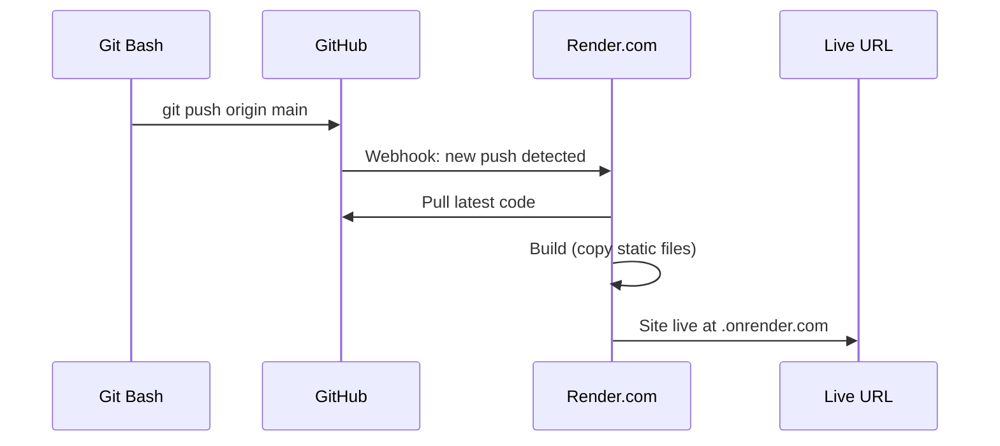

# Lab 10 — Deploy to Render

## 1. Objective

Deploy the `company-website` (static HTML/CSS/JS) to Render using GitHub as the source. Every push to `main` automatically triggers a new deployment. Then tackle the challenge task to deploy the Node.js `ecommerce-app`.

---

## 2. Architecture Diagram



---

## 3. Prerequisites

- `sample-repositories/company-website/` folder from this repo
- GitHub free account
- [Render free account](https://render.com/) — no credit card required
- Git Bash open

---

## 4. Setup

```bash
cd "c:/CLOUD/OneDrive - Hogarth Worldwide/Documents/Ostad/MasteringDevOps/Git-Fundamentals"
ls sample-repositories/company-website/
# index.html  about.html  contact.html  styles/  scripts/  README.md
```

---

## 5. Step-by-Step Tasks

### Task 1 — Create a Separate GitHub Repo for the Website

```bash
cd sample-repositories/company-website

# Initialize as its own Git repo
git init
git add .
git commit -m "feat: initial company website"

# Create repo on GitHub (requires GitHub CLI)
# Install gh: https://cli.github.com
gh repo create company-website --public --push --source=.
```

**Without GitHub CLI:**
1. Create `company-website` repo manually on GitHub (empty, public)
2. Then:
```bash
git remote add origin https://github.com/md-sarowar-alam/company-website.git
git push -u origin main
```

> 📸 Screenshot: GitHub showing the company-website repo with the HTML files listed

### Task 2 — Connect to Render

1. Go to [dashboard.render.com](https://dashboard.render.com)
2. Click **New +** → **Static Site**
3. Click **Connect GitHub** and authorize Render
4. Select the `company-website` repository
5. Configure:

| Setting | Value |
|---------|-------|
| Name | `company-website` (or any unique name) |
| Branch | `main` |
| Root directory | *(leave blank)* |
| Build command | *(leave blank — it's just HTML)* |
| Publish directory | `.` |

6. Click **Create Static Site**

> 📸 Screenshot: Render "Create Static Site" form with settings filled in

### Task 3 — Watch the Deployment

1. Render shows a build log
2. Within 30 seconds, status changes to **Live**
3. Your site is at: `https://company-website-xxxx.onrender.com`

Open the URL in your browser. You should see the company website home page.

> 📸 Screenshot: Render dashboard showing "Live" status with the .onrender.com URL

### Task 4 — Make a Change and Watch Auto-Deploy

```bash
cd sample-repositories/company-website

# Change the page title
sed -i 's/<title>DevOps Corp<\/title>/<title>DevOps Corp — Powered by Git<\/title>/' index.html

git add index.html
git commit -m "chore: update page title"
git push origin main
```

1. Go to your Render dashboard
2. Watch the new deployment trigger automatically (shows "In progress")
3. Once complete, refresh your live URL — the title has changed

### Task 5 — Roll Back a Bad Deployment

```bash
# Simulate a bad change
echo "BROKEN_CONTENT" > index.html
git add index.html
git commit -m "oops: broke the homepage"
git push origin main
```

Wait for Render to deploy. Your homepage is now broken.

**Roll back via Git:**
```bash
git revert HEAD
git push origin main
# Render redeploys the reverted version
```

**Roll back via Render UI:**
1. Render dashboard → your service → **Events** tab
2. Find a previous successful deploy
3. Click **Rollback to this deploy**

> 📸 Screenshot: Render Events tab showing deployment history with rollback option

### Task 6 — Add Environment Variables (practice)

Even though the static site doesn't use them, practice the workflow:

1. Render dashboard → your service → **Environment**
2. Add: `SITE_ENV` = `production`
3. Click **Save Changes** (triggers a redeploy)

In a real Node.js app, you'd access this with `process.env.SITE_ENV`.

---

## 6. Validation

```bash
# Confirm your site is live
curl -I https://your-site.onrender.com
# Should return: HTTP/2 200

# Confirm auto-deploy works
echo "<!-- test -->" >> index.html
git add index.html
git commit -m "test: verify auto-deploy"
git push origin main
# Watch Render dashboard for the new deploy
```

---

## 7. Expected Output

```
$ git push origin main
Enumerating objects: 5, done.
...
To https://github.com/md-sarowar-alam/company-website.git
   abc123d..def456e  main -> main

# Render dashboard shows:
Deploy triggered by push to main (def456e)
Status: Live ✓
URL: https://company-website-abc1.onrender.com
```

---

## 8. Troubleshooting

**"Build failed" on Render**
→ For a static site with no build command, this usually means the publish directory is wrong. Set it to `.` (dot — the root).

**Site shows "Not found" or Render's default page**
→ Make sure `index.html` is at the root of the repo, not in a subfolder. Check the **Publish directory** setting.

**GitHub not listed in Render's repo selector**
→ You need to authorize Render to access your GitHub account. Go to Render → Account → GitHub and grant access.

**Auto-deploy not triggering**
→ Check that the branch in Render settings matches the branch you're pushing to (`main`).

---

## 9. Cleanup

```bash
# Delete the company-website GitHub repo
gh repo delete md-sarowar-alam/company-website --yes

# If you completed the challenge task, delete that repo too
gh repo delete md-sarowar-alam/ecommerce-app --yes

# Remove local folders
cd sample-repositories
rm -rf company-website/.git
rm -rf ecommerce-app/.git
```

To remove from Render:
1. Render dashboard → your service → **Settings** → **Delete Service**

---

## 10. Challenge Task — Deploy the Node.js ecommerce-app

**Requirements:** Node.js v18+ installed locally

```bash
cd sample-repositories/ecommerce-app

# Create its own GitHub repo
git init
git add .
git commit -m "feat: initial ecommerce app"
gh repo create ecommerce-app --public --push --source=.
```

On Render:
1. **New +** → **Web Service**
2. Select `ecommerce-app`
3. Configure:

| Setting | Value |
|---------|-------|
| Environment | `Node` |
| Build command | `npm install` |
| Start command | `node app.js` |

4. Under **Environment Variables**, add:
   - `PORT` = `3000`
   - `NODE_ENV` = `production`

5. Deploy and open the live URL

**Note:** Free tier web services spin down after 15 minutes of inactivity. The first request after spin-down takes ~30 seconds (cold start).

---

Previous: [Lab 09 →](../lab-09-history-recovery/README.md) · Back to [Labs index →](../README.md)
