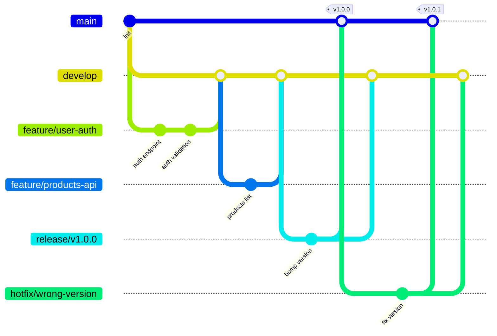

# Project 03 — GitFlow Simulation

You'll implement the full **Git Flow** branching model from scratch — `main`, `develop`, `feature/*`, `release/*`, and `hotfix/*` — on a realistic project.

---

## The Scenario

Your team is building **Nexus API** — a simple REST API (Node.js/Express). You're releasing v1.0.0 in two weeks. Two features are in development. A bug exists in the current live version. GitFlow is the team's agreed workflow.

---

## Branch Reference (keep this open)

```
main      → production-ready code, tagged releases only
develop   → integration branch, next release
feature/* → branches off develop, merges back to develop
release/* → branches off develop when ready, merges to main + develop
hotfix/*  → branches off main, merges to main + develop
```

---

## Phase 1 — Initialize GitFlow

```bash
mkdir nexus-api
cd nexus-api
git init

# Create the base app
cat > app.js << 'EOF'
const express = require('express');
const app = express();
app.use(express.json());

app.get('/', (req, res) => res.json({ status: 'ok', version: '0.0.1' }));

const PORT = process.env.PORT || 3000;
app.listen(PORT, () => console.log(`Nexus API running on port ${PORT}`));
EOF

cat > package.json << 'EOF'
{
  "name": "nexus-api",
  "version": "0.0.1",
  "main": "app.js",
  "scripts": { "start": "node app.js" },
  "dependencies": { "express": "^4.18.0" }
}
EOF

echo "node_modules/" > .gitignore
git add .
git commit -m "chore: initialize Nexus API project"

# Create the develop branch
git switch -c develop
git push origin develop

gh repo create nexus-api --public --push --source=.
```

---

## Phase 2 — Feature 1: User Authentication Endpoint

```bash
git switch develop

git switch -c feature/user-auth
```

Add to `app.js` before the PORT line:
```javascript
// User authentication endpoint
app.post('/auth/login', (req, res) => {
  const { username, password } = req.body;
  if (username === 'admin' && password === 'secret') {
    return res.json({ token: 'jwt-placeholder-token', user: username });
  }
  return res.status(401).json({ error: 'Invalid credentials' });
});
```

```bash
git add app.js
git commit -m "feat(auth): add login endpoint"

# Add one more commit
echo "// auth validation added" >> app.js
git add app.js
git commit -m "feat(auth): add input validation"

# Merge back to develop
git switch develop
git merge --no-ff feature/user-auth -m "feat: merge user authentication"
git branch -d feature/user-auth
```

---

## Phase 3 — Feature 2: Products Endpoint (in parallel)

```bash
git switch develop
git switch -c feature/products-api
```

Add to `app.js`:
```javascript
// Products endpoint
const products = [
  { id: 1, name: 'Nexus Pro', price: 99 },
  { id: 2, name: 'Nexus Team', price: 299 }
];

app.get('/products', (req, res) => res.json(products));
app.get('/products/:id', (req, res) => {
  const product = products.find(p => p.id === parseInt(req.params.id));
  if (!product) return res.status(404).json({ error: 'Product not found' });
  res.json(product);
});
```

```bash
git add app.js
git commit -m "feat(products): add product listing endpoint"
git commit --allow-empty -m "feat(products): add product by ID endpoint"

git switch develop
git merge --no-ff feature/products-api -m "feat: merge products API"
git branch -d feature/products-api

git log --oneline --graph develop | head -10
```

---

## Phase 4 — Release Preparation (release/v1.0.0)

When `develop` is ready for release, create a release branch:

```bash
git switch develop
git switch -c release/v1.0.0
```

On the release branch — only bug fixes, version bumps, and docs:

```bash
# Update version in package.json
sed -i 's/"version": "0.0.1"/"version": "1.0.0"/' package.json

# Update version endpoint
sed -i 's/version: .0.0.1./version: "1.0.0"/' app.js

git add .
git commit -m "chore: bump version to 1.0.0"

# Add release notes
cat > RELEASE_NOTES.md << 'EOF'
# v1.0.0 Release Notes

## Features
- POST /auth/login — user authentication
- GET /products — list all products
- GET /products/:id — get product by ID

## Breaking Changes
None — this is the first stable release.
EOF

git add RELEASE_NOTES.md
git commit -m "docs: add v1.0.0 release notes"
```

---

## Phase 5 — Merge Release into Main and Develop

```bash
# Merge to main
git switch main
git merge --no-ff release/v1.0.0 -m "release: v1.0.0"
git tag -a v1.0.0 -m "v1.0.0 — First stable release"

# Merge back to develop (picks up the version bump)
git switch develop
git merge --no-ff release/v1.0.0 -m "chore: merge release/v1.0.0 back to develop"

# Delete release branch
git branch -d release/v1.0.0

git push origin main develop --follow-tags
```

---

## Phase 6 — Hotfix While Develop Continues

A critical bug is reported in production: the `/` endpoint returns the wrong version string.

```bash
# Hotfix branches off MAIN, not develop
git switch main
git switch -c hotfix/wrong-version-response

sed -i 's/version: "1.0.0"/version: process.env.npm_package_version || "1.0.0"/' app.js

git add app.js
git commit -m "fix: use package.json version in health endpoint"

# Merge to main
git switch main
git merge --no-ff hotfix/wrong-version-response -m "hotfix: fix version response"
git tag -a v1.0.1 -m "v1.0.1 — Hotfix: version response"

# ALSO merge to develop so the fix doesn't get lost
git switch develop
git merge --no-ff hotfix/wrong-version-response -m "chore: apply hotfix to develop"

git branch -d hotfix/wrong-version-response

git push origin main develop --follow-tags
```

---

## Final Validation

```bash
git log --oneline --graph --all | head -25

git tag
# v1.0.0, v1.0.1

git branch -a
# main, develop (features and hotfix branches deleted)

# main contains all features + hotfix
git log main --oneline | grep -E "auth|products|hotfix"
```

---

## GitFlow Summary Diagram



---

## What You Practiced

- The full GitFlow model: `main`, `develop`, `feature`, `release`, `hotfix`
- Parallel feature development on `develop`
- Release branch stabilization before merging to `main`
- Hotfix workflow from `main` back to both `main` and `develop`
- Semantic versioning with annotated tags at each release point

---

Back to [mini-projects](../README.md)
